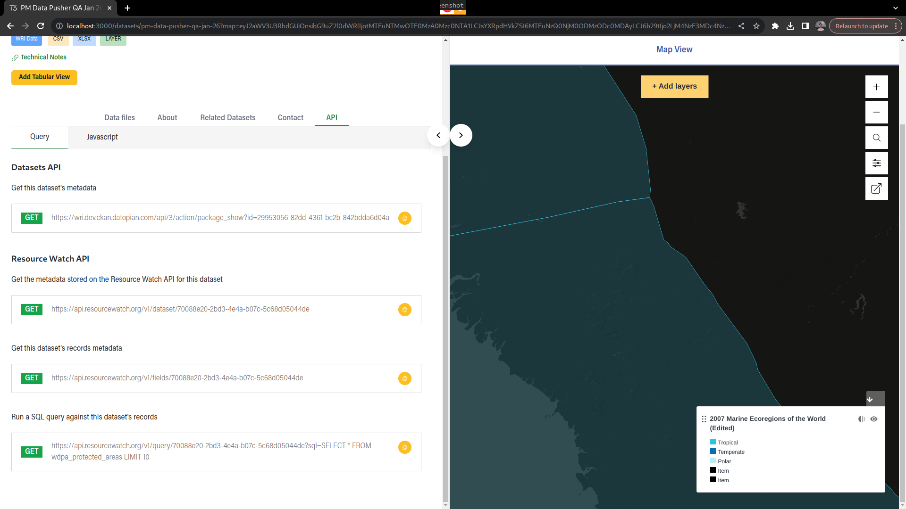

## API Endpoints

On the dataset page, users can find an API tab on the dataset metadata header and an API Endpoints button on the data files cards.

### Dataset API Endpoints

By accessing the API tab on the dataset header, two other tabs will appear: "Query" and "JavaScript".

Both tabs show the same endpoints, but in the "Query" tab the endpoints are documented as raw requests, with information regarding URL, HTTP method and body, while on the JavaScript tab the endpoints are documented as JavaScript snippets, using the Node native Fetch API.

The following endpoints are covered:

- Datasets API (equivalent to the CKAN API)
    - Get dataset's metadata
- Resource Watch API
    - Get the metadata stored on the Resource Watch API for this dataset
    - Get this dataset's records metadata
    - Run a SQL query against this dataset's records

Note that records in this case are related to the connector URL and providers metadata fields and won't be shown if these metadata fields are not provided.

### Data Files API Endpoints

By clicking the API Endpoints button on the datafile card, a modal with the "Query" and "JavaScript" tabs will show up.

Similar to the Dataset API Endpoints, both tabs show the same endpoints, but in the "Query" tab the endpoints are documented as raw requests, with information regarding URL, HTTP method and body, while on the JavaScript tab the endpoints are documented as JavaScript snippets, using the Node native Fetch API.

The following endpoints are covered:

- Datasets API (equivalent to the CKAN API)
    - Get data files's metadata
    - Get raw files
    - Get this data file's records metadata
    - Search this data file's records
    - Run a SQL query against this data file's records
- Resource Watch API
    - Get the layer object associated with this data file

