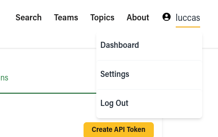
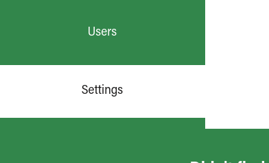
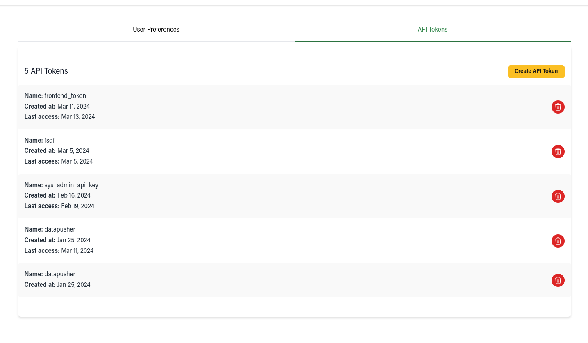
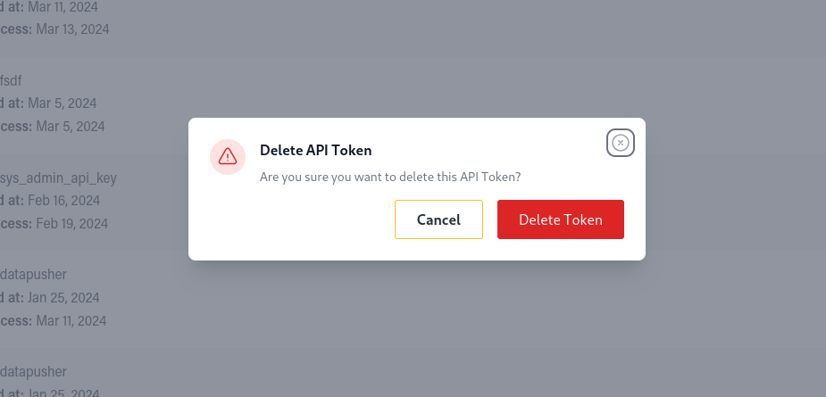
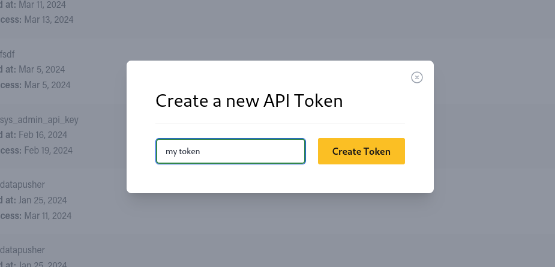
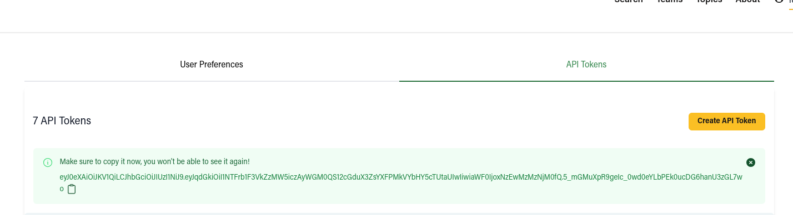

# API Tokens

You can access the API Tokens page by either going to your user dropdown and clicking on `Settings`

Or by clicking on `Settings` in the sidebar

There once you click in the `API Tokens` tab you will be granted with the list of all your users tokens

There you can click on the Trash icon next to the token to delete it, to which you will be prompted for confirmation

You can also create a new Token by clicking on `Create API Token`, to which you will be prompted to give the token a name

Once created you will be given a single opportunity to copy the token, after that you will never be able to see it again

