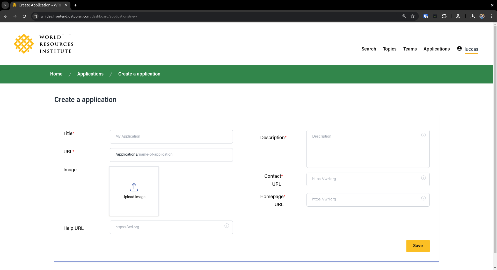
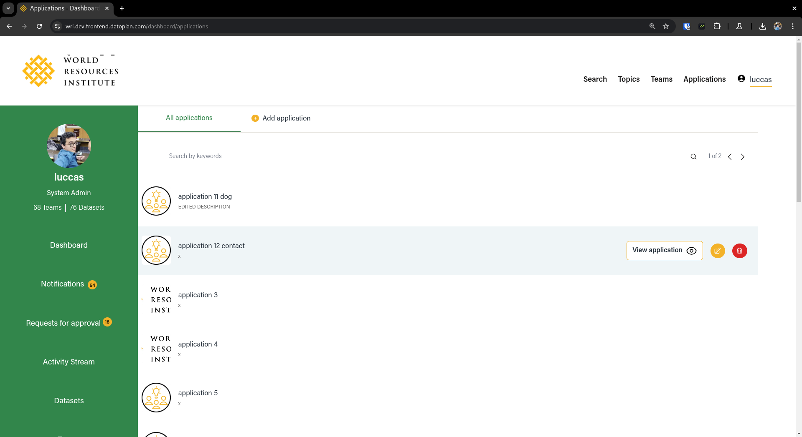
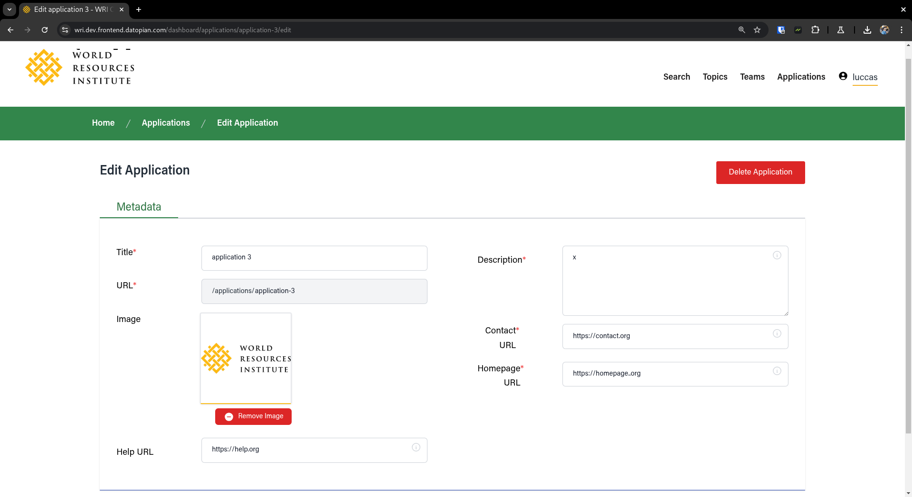
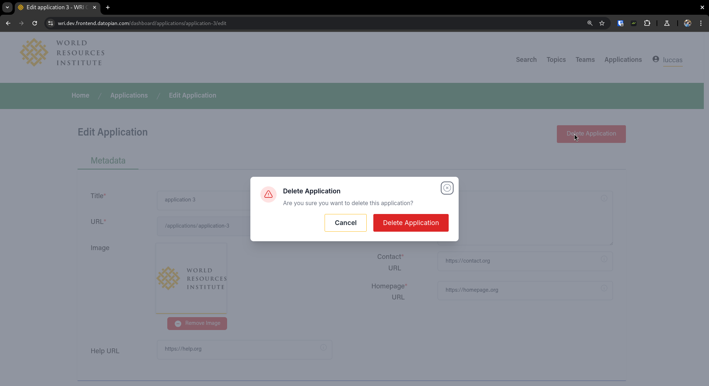
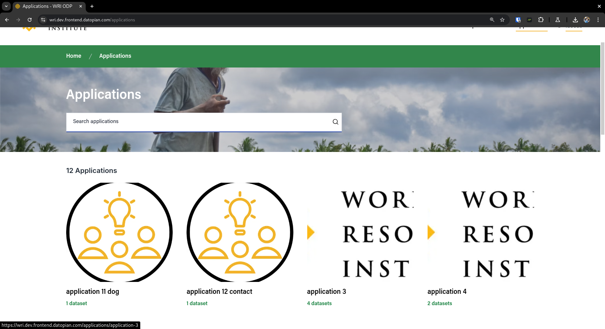
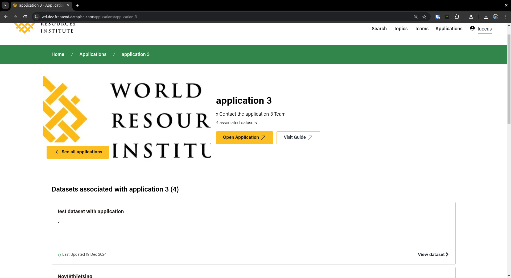

# APPLICATIONS

## Create Application

You can create a application in the `/dashboard/applications/new` route where you can define

- Title for the application
- URL for the application, which is going to act as an ID for the application, and act as URL in the public pages such `/applications/{application url}`
- Description for the application
- You can also upload an image to act as a logo or featured image for the application
- A Homepage URL for the application
- A Contact URL for the application
- A Help URL for the application

The page looks like this

## Edit Application

You can edit a application by going to `/dashboard/applications/{application url}/edit` or by clicking on the yellow icon in the applications list like in the image below

Once you go there you can change all the fields that were defined in the new application except the `url` which needs to stay the same for the integrity of the system's sake

In this edit page, you can also delete by clicking on the "Delete Button" which should open up a modal for confirmation

## Application Discovery

Application discovery `/applications`. contains all available applications

Applications are searchable and paginated. clicking on any of the applications leads to their individual details
page, containing their associated datasets

