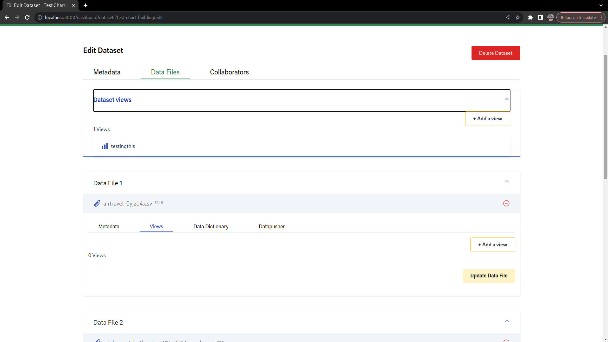
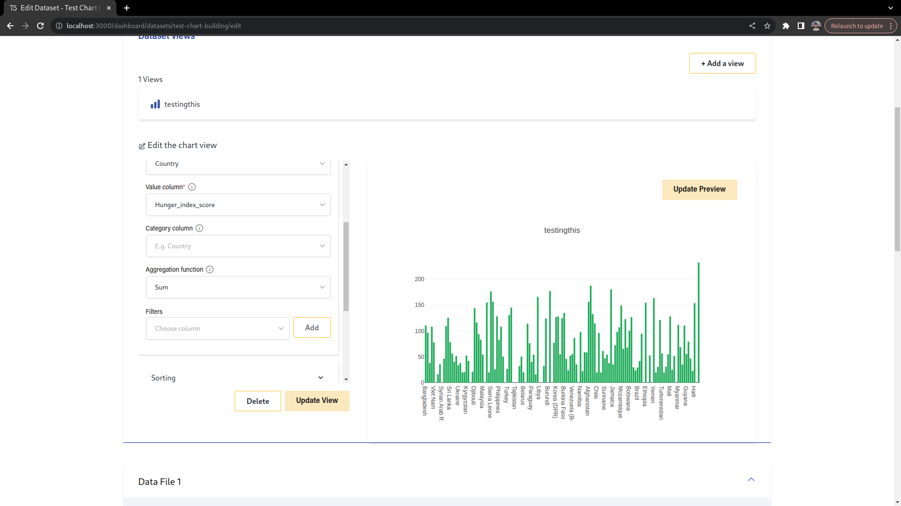
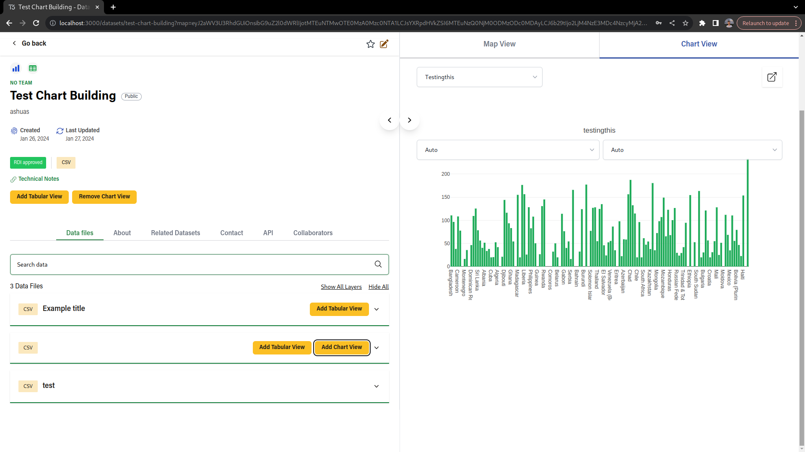

## Chart View

There are two types of supported chart views: dataset views and data file views.

Data files views fetch data from datastore, while dataset views fetch data from the RW dataset section (i.e. connector URL).

### Manage charts

To create a chart, head to the "Data Files" section on the dataset edit page.

Next, if the dataset has the RW dataset section filled, you should see this section:

From there, dataset views can be created.

For data file views, click on the "Views" section and all the views should show up.

In both cases, if the datafile is "datastore_active" or if the dataset has the RW dataset section filled, clicking on "Add a view" and then "Chart" will show the chart creation form.

### Editor

When creating or editing forms, there's a series of different options that can be changed.

The first two options are title and type. Title is a text that is shown above the chart, while chart type can be either bar, line or pie.

#### Data

The data section, in summary, controls the source data. Based on the options of this section, a SQL query will be built and run against the chosen data source.

In the two main fields are dimension and measure. These two fields define what is the column that will be used to build the labels and what is the column that will be used to get the data (similar to X and Y axis).

The category field allows the data to be grouped.

Aggregation function allows the data to be reduced by a function. E.g. if aggregation function is Sum, all the "measure" values associated with a given "dimension" will be summed.

Filters are equivalent to where clauses on SQL queries and allow the data to be filtered based on a column name and operation (e.g. ==, >=, etc). Multiple filters can be added at the same time and can have different logical operators ("OR" and "AND").

#### Sorting

The sorting section allows the data points to be sorted, either by Labels or Data. Sorting can be ASC or DESC.

#### Labels

In this section, you can choose a title for the X and Y axis, besides also choosing the angle of the ticks for each axis.

#### Legends

Legends can be enabled or disabled and given a name.

#### Tooltips

Tooltips can be enabled or disabled. If enabled, a "format" can be choosen for the tooltips.

#### Colors

The color section controls the colors of the charts. This is done by a "starting" and an "ending" color that will be used to generate a gradient, which is applied to the data points.

### View charts

To visualize charts, head to the dataset page.

If there are charts associated with the dataset, an "Add Chart View" button will be visible on the dataset page header. The same happens for data files.

