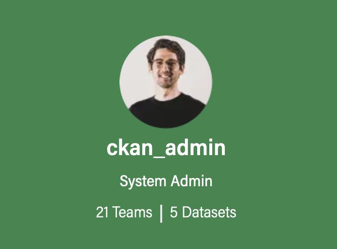
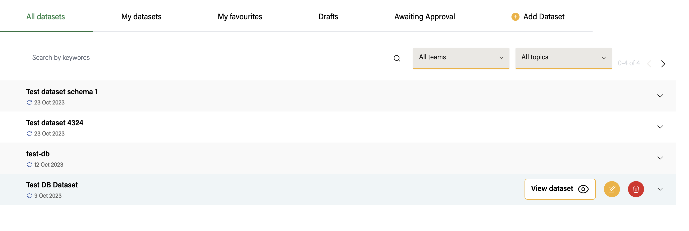
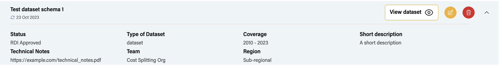
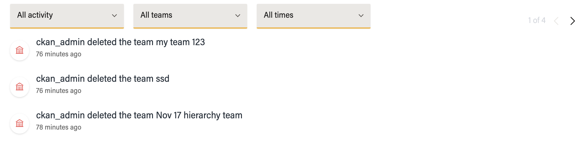
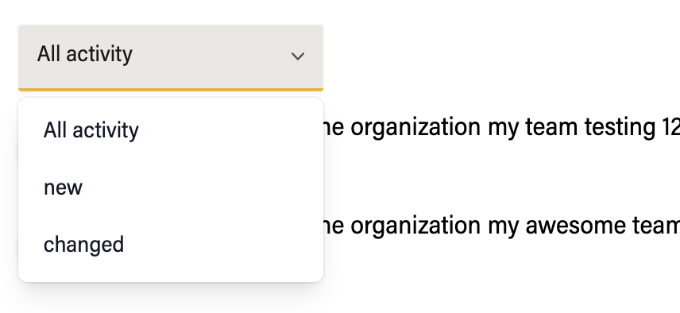
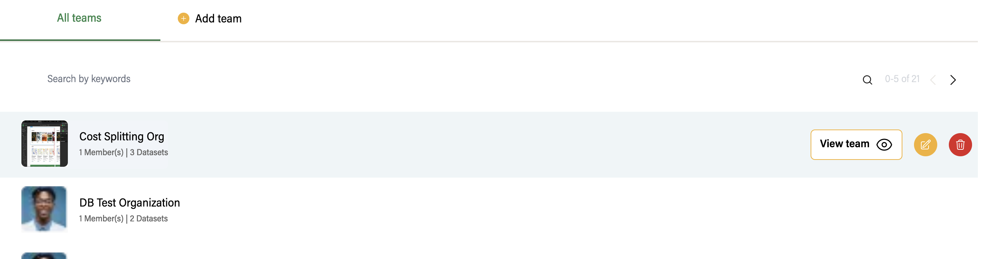
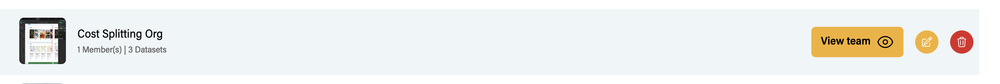
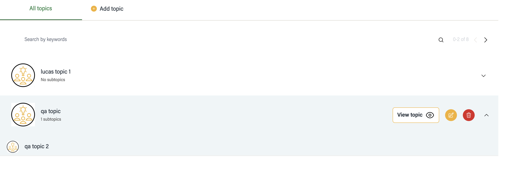
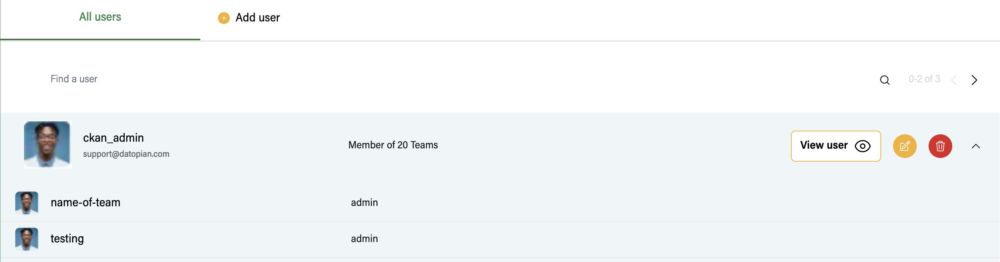

## DashBoard

`/dashboard` - to visit dashboard page

The left sidebar contains the login user details and accessible list of pages

-user profile-

## Dashboard dataset Page `/dashboard/datasets`

Contain tabs of different categories of dataset

Each dataset item on hover contains a dropdown button to show it full details

You can also Search, filter by `teams` and `topics`, also check paginated data

Note: for search, you can click enter key after typing the keyword

## Activity stream `/dashboard/activity-stream`

List all actions , like delete, update and creation of dataset, Teams and topics

contains filter by activity type  and pagination

## Teams `/dashboard/teams`

Display list of teams the user have access to

- contains search functionality and pagination

- On hover each Team profile , you can see the button `view teams` to go to that team page

on hover

## Topics `/dashboard/topics`

Display the list of topics user have access to

Each Topics has a drop down that display list of subtopics

## Users `/dashboard/users`

Display list of users

Each user row contains dropdown to display list of teams user belongs to

