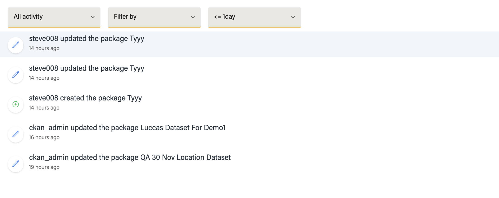

## DashBoard

`/dashboard` - to visit dashboard page

The left sidebar contains the login user details and accessible list of pages

-user profile-

Also contains Main content section

The `Quick action` container contains button that easily link to creating some of the entities.

And the `see all ->` on other container leads to the main page of that container

The setting button once clicked enables the container to be rearranged using drag and drop action

and once then with re-arrangement click the check button to save the arrangment for your next visit.

## Dashboard dataset Page `/dashboard/datasets`

Contain tabs of different categories of dataset

Each dataset item on hover contains a dropdown button to show it full details

You can also Search, filter by `teams` and `topics`, also check paginated data

Note: for search, you can click enter key after typing the keyword

## Activity stream `/dashboard/activity-stream`

List all actions , like delete, update and creation of dataset, Teams and topics

contains filter by activity type  and pagination

contains filter by time and days

contains filter by Teams

## Teams `/dashboard/teams`

Display list of teams the user have access to

- contains search functionality and pagination

- On hover each Team profile , you can see the button `view teams` to go to that team page

on hover

## Topics `/dashboard/topics`

Display the list of topics user have access to

Each Topics has a drop down that display list of subtopics

## Users `/dashboard/users`

Display list of users

Each user row contains dropdown to display list of teams user belongs to

### Delete Entities

Each entities ( Dataset, Team, Topics and Users), have thesame delete approach

here is how you delete a Dataset has an authorized user

- Place your mouse over the dataset you want to delete to see the delete button

- click the the confirm delete button

- remove user from an organization: click on the delete button in the user drop down to remove user from an organization

