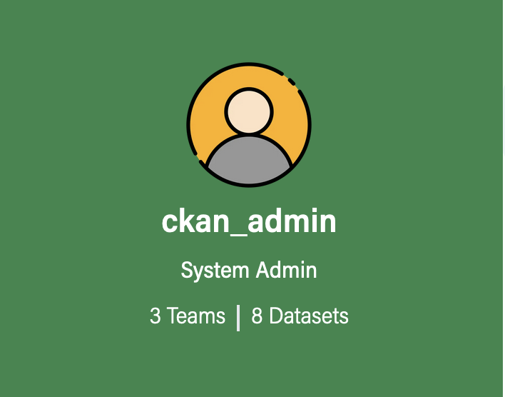
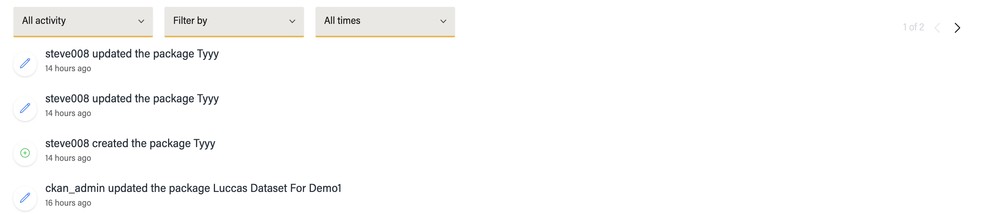
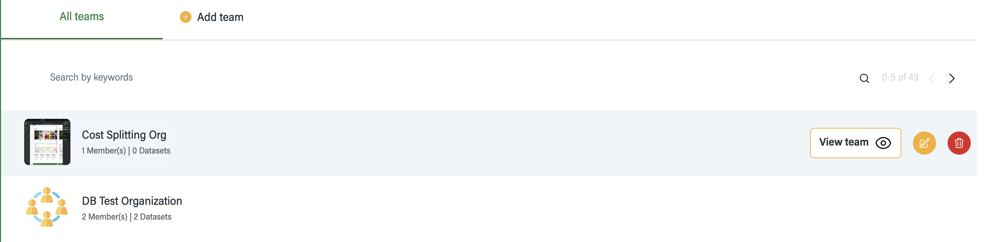
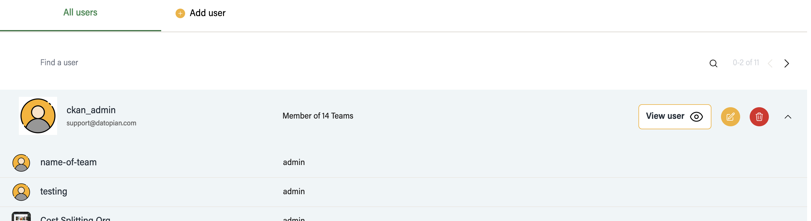
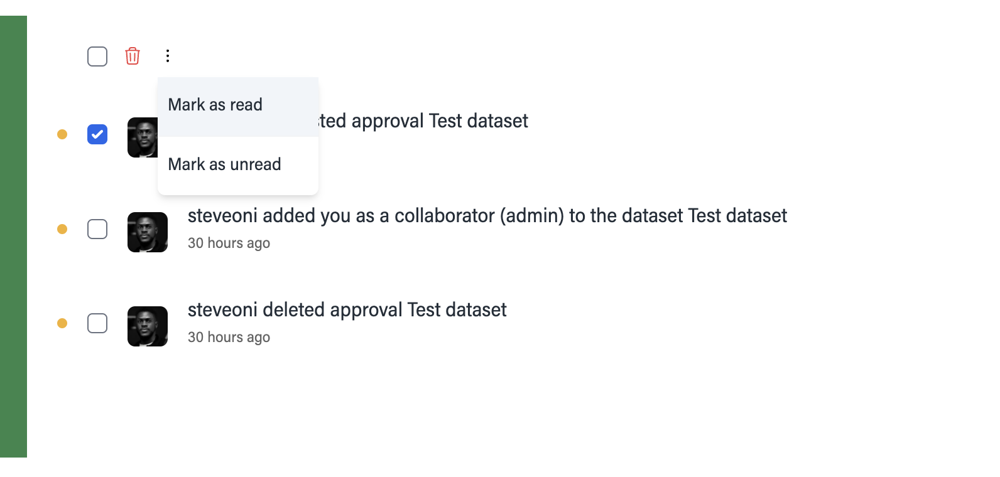
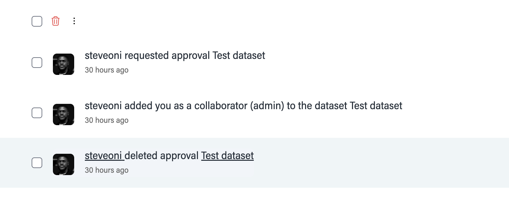
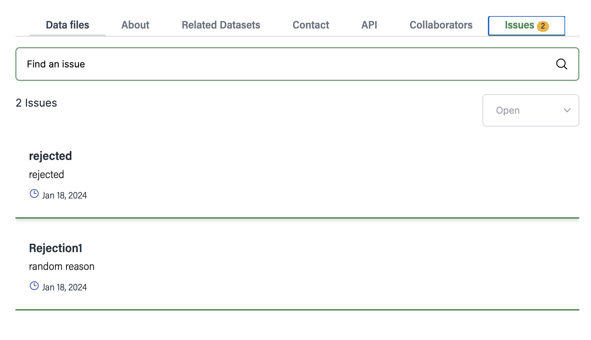
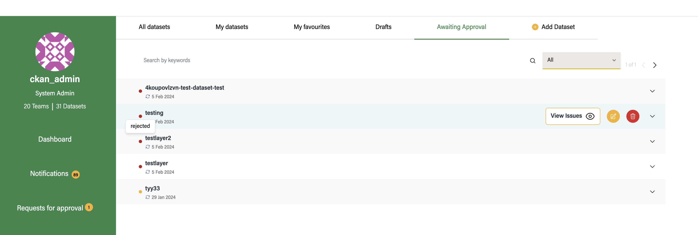
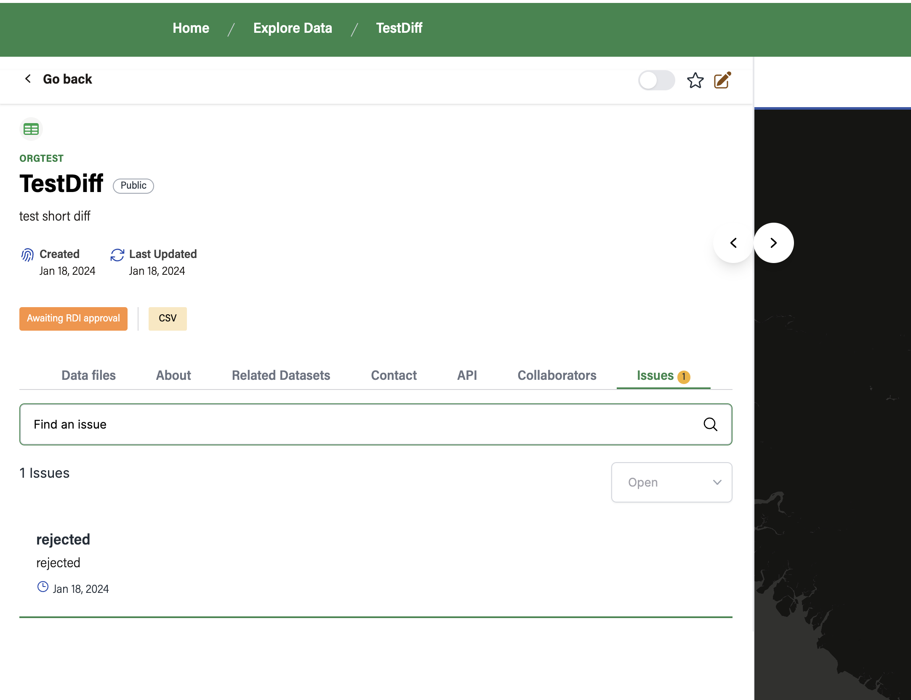

## DashBoard

`/dashboard` - to visit dashboard page

The left sidebar contains the login user details and accessible list of pages

-user profile-

Also contains Main content section

The `Quick action` container contains button that easily link to creating some of the entities.

And the `see all ->` on other container leads to the main page of that container

The setting button once clicked enables the container to be rearranged using drag and drop action

and once then with re-arrangement click the check button to save the arrangment for your next visit.

## Dashboard dataset Page `/dashboard/datasets`

Contain tabs of different categories of dataset

Each dataset item on hover contains a dropdown button to show it full details

You can also Search, filter by `teams` and `topics`, also check paginated data

Note: for search, you can click enter key after typing the keyword

## Activity stream `/dashboard/activity-stream`

List all actions , like delete, update and creation of dataset, Teams and topics

contains filter by activity type and pagination

contains filter by time and days

contains `Filter by` select options: this let you chose the entity you want to filter the activity stream by, either by dataset favorites or Teams you are following or belong to

In the filterby you can select dataset for example to see list of dataset you are following

then click on one of the dataset

you can also select filter by Teams

and then select the team

## Teams `/dashboard/teams`

Display list of teams the user have access to

- contains search functionality and pagination

- On hover each Team profile , you can see the button `view teams` to go to that team page

on hover

## Topics `/dashboard/topics`

Display the list of topics user have access to

Each Topics has a drop down that display list of subtopics

## Users `/dashboard/users`

Display list of users

Each user row contains dropdown to display list of teams user belongs to

### Delete Entities

Each entities ( Dataset, Team, Topics and Users), have thesame delete approach

here is how you delete a Dataset has an authorized user

- Place your mouse over the dataset you want to delete to see the delete button

- click the the confirm delete button

- remove user from an organization: click on the delete button in the user drop down to remove user from an organization

### Notification

Notification page can be accessed via `/dashboard/notifications`

As you can see, we have 3 unread notification on the sidebar, and also the yellow div beside each notification row shows that its unread

We can mark on of them unread

click update

can also do **bulk update** e.g mark all as read

every notification is now marked has read

Also on hover you can go the the sender user page and also the dataset page

Notification can also ve view from the overview dashboard page `/dashboard`

## Favorite Dataset

To add dataset to favorite, go to the dataset page and click on the star icon

click add in the popup modal to confirm action

see changed refelected

also favorite get reflected in `/dashboard` overview

and also in `/dashboard/datasets` page

Dataset can be remove from favorite

click on the star icon

see changed reflected

## Add User

To add user to the platform visit `/dashboard/users` and click on Add user tab

You can add a user without assigning them to a team

And if a team is selected , the Role field get displayed

and once the user is created the user should recieve a notification.

Also you can visit the users page to view newly added user

## Approval workflow

Visit `dashboard/approval-request`

The page contain the list of dataset in approval workflow. The yellow indication ebhnd the dataset shows the dataset is still pending (not yet rejected, and if approved, it won't be on the list). Also the side par contains the count of pending dataset

Quick review of dataset

If dataset have no diff (i.e no new version) current metadata are displayed

Dataset can be rejected with a reason

add reason for rejection

Click on review to go to dataset page for review

The toggle button is used to toglle between new version and old version. if there is no new version, toggle won't appear

version review:

Click on the issue tab to see list of issues, it has dropdown for open and close issues

let comment and re-open an issue

Delete a dataset

result after delete

User can go do `dashboard/datasets` and click Awaiting approval to see list of awaiting approval dataset

click on `view issues` to go to dataset page to see if any issues

