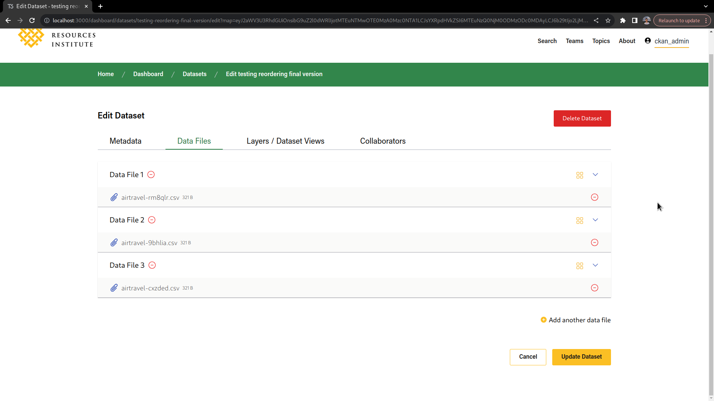

# Data Files Reordering

When creating or editing a dataset, it's possible to reorder data files and layers.

To do so, drag the knob by the side of the expansion arrow on the data file card and move the data file to the desired position.

## Approval workflow

The data files reordering feature is compatible with the approval workflow, and reordered datafiles will only be flagged as changed if any of the data file properties have changed, no matter its new position.

