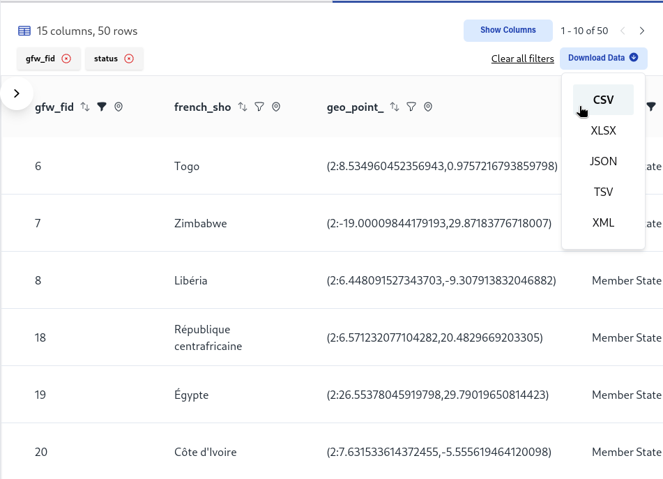
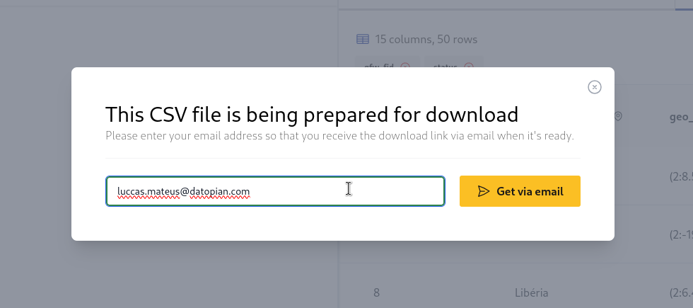

## Datafile Downloads

On the dataset page, it's possible to download datafiles.

### Tabular data files

If the resource is tabular and pushed to the datastore, when clicking the download button a dropdown menu will be shown, in which the user can choose one of the following formats:

- CSV
- TSV
- JSON
- XML
- XLSX

Note that if the original data file is in any of these formats, the format will be indicated as "Original Format ({format})".

If the user clicks on the original format, the download will start immediately.

Otherwise, the user will be prompted with an email input, in which he's going to receive the datafile data converted to the desired file format.

### Layer data files

Similar to what happens with tabular data files, layers can be converted to any of the formats listed above, but note that only Layers whose provider is "cartodb" support downloads.

### Other data files

Data files that are not layers or tabular, such as images or URLs, will show only one option on the download dropdown: Original Format.

## Download of subsets

If you can use the button `View Tabular Preview` either at the dataset level of at the datafile level, then that means you can download a subset of that data, by clicking in `Download Data`

The filters and sorting columns used to show the preview will also be used to download the data, in one of the following formats

- CSV
- TSV
- JSON
- XML
- XLSX

On clicking in one of the formats the user will be prompted with an email input, in which he's going to receive the datafile data converted to the desired file format.

