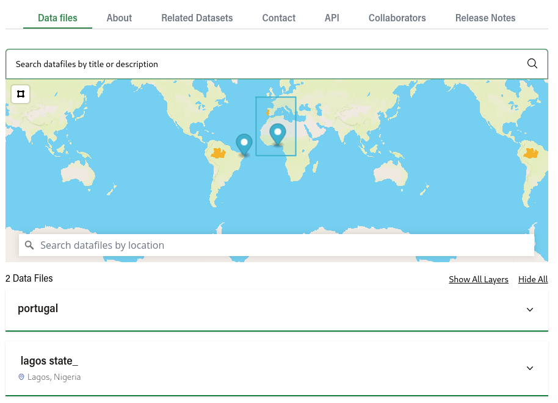
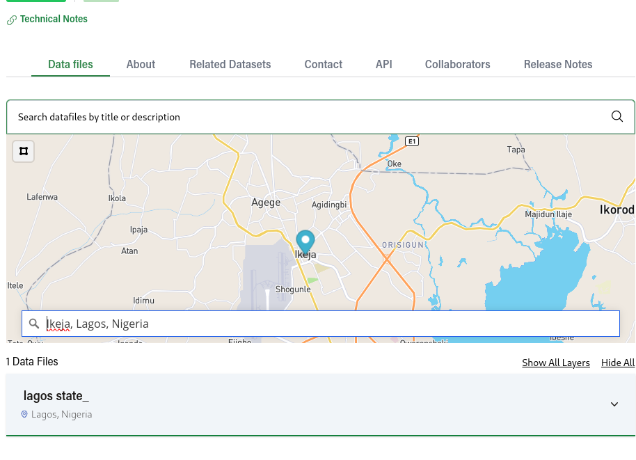

## Datafile Location Search

Datafiels can be geospatially indexed and searched based on either a GeoJSON file's geometry or on a location address, similar to the geospatial indexing of datasets.

### Geospatial indexing

When creating or editing a datafile, users can use the Location Coverage section to speciy how the data file should be geospatially indexed.

Note that this also applies to layers:

### Custom datafile location search action

A custom action was created so that files can be geospatially searched.

The name of the action is `resource_location_search` and it accepts the following parameters:

- `package_id` - ID of the package to which the data files that are being searched belong to
- `is_pending` - Whether to search on the pending or the approved version of the dataset
- `bbox` - Bbox indicating an area to be searched, e.g. 0,0,0,0
- `point` - Coordinates of a point to be searched, e.g. 60,-3
- `spatial_address` - Name of a location, e.g. Amazonas, Brazil

### UI For searching

On the Datafile tab in the dataset individual page you will be able to see a map with markers and yellow vectors, if you setup a datafile with an address, a blue marker will show up in the map on the center of that particular address,
while if you added a geojson location a yellow vector will show up on the map, these objects will appear and disappear as you search using the input above for the metadata in the datafiles.

In that map you can search using a bbox by clicking on the square at the top left section of the map, and drawing an rectangle on it

- If that rectangle intersects or covers a geojson shape that is attached to a datafile, that datafile will then appear
- If that rectangle covers the center coordinate of an address that is attached to a datafile, that datafile will also appear

You can toggle that bbox by clicking on the rectangle icon

Besides that we also have an autocomplete field for addresses, which will match in the following way

- If the center of that address is inside the geojson attached to a datafile, then that datafile will appear
- If the address typed matches or is contained by the address in a specific datafile, than that datafile will appear, for example, in the image below, we have a datafile that is attached to the state of Lagos in Nigeria, if we type Ikeja, Lagos, Nigeria, which is a city inside that particular state, the result will match, given that possibly data about the state of Lagos will also contain data about that particular city

