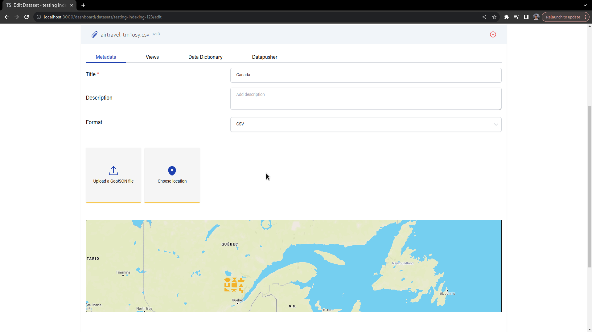
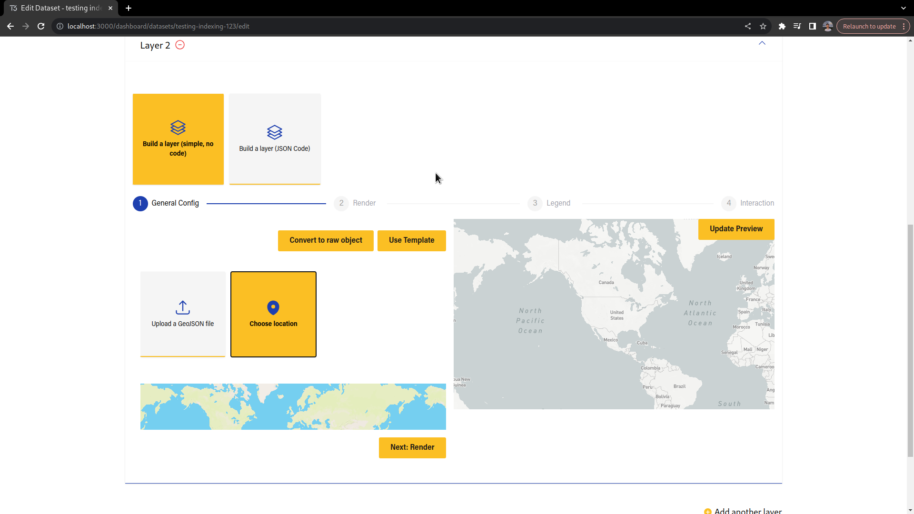

## Datafile Location Search

Datafiels can be geospatially indexed and searched based on either a GeoJSON file's geometry or on a location address, similar to the geospatial indexing of datasets.

### Geospatial indexing

When creating or editing a datafile, users can use the Location Coverage section to speciy how the data file should be geospatially indexed.

Note that this also applies to layers:

### Custom datafile location search action

A custom action was created so that files can be geospatially searched.

The name of the action is `resource_location_search` and it accepts the following parameters:

- `package_id` - ID of the package to which the data files that are being searched belong to
- `is_pending` - Whether to search on the pending or the approved version of the dataset
- `bbox` - Bbox indicating an area to be searched, e.g. 0,0,0,0
- `point` - Coordinates of a point to be searched, e.g. 60,-3
- `spatial_address` - Name of a location, e.g. Amazonas, Brazil

