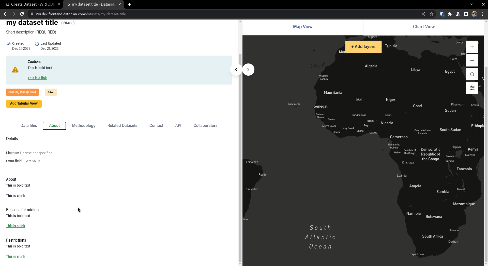

# DATASETS + DATAFILES

## Create datasets

You can create a dataset by clicking in the `Add Dataset` quick action

Or in the `/dashboard/datasets` route you can click in `Add Dataset`

Or by just going to `/dashboard/datasets/new`

You will be prompted with the following sections

Obs: Fields that have a red * are required

### Overview 

Where the main metadata fields are defined

If you select the `featured dataset` checkbox an image uploader will appear where you can define a thumbnail for your dataset

### Location 

Where you can select the location for your dataset which can then be queried in the search page

You can either define a point on a map with the help of a Address search field

Or you can upload a GeoJSON file that will appear as a vector polygon on the map, if you do that the search will check if the address provided by the user is inside that polygon in the dataset search page

### Description

A short description to live in the header + a long rich text description that lives in the About tab in the dataset page, the long description field allow rich text elements such as bold/italic and links

### UI For searching

On the Datafile tab in the dataset individual page you will be able to see a map with markers and yellow vectors, if you setup a datafile with an address, a blue marker will show up in the map on the center of that particular address,
while if you added a geojson location a yellow vector will show up on the map, these objects will appear and disappear as you search using the input above for the metadata in the datafiles.

In that map you can search using a bbox by clicking on the square at the top left section of the map, and drawing an rectangle on it

- If that rectangle intersects or covers a geojson shape that is attached to a datafile, that datafile will then appear
- If that rectangle covers the center coordinate of an address that is attached to a datafile, that datafile will also appear

You can toggle that bbox by clicking on the rectangle icon

Besides that we also have an autocomplete field for addresses, which will match in the following way

- If the center of that address is inside the geojson attached to a datafile, then that datafile will appear
- If the address typed matches or is contained by the address in a specific datafile, than that datafile will appear, for example, in the image below, we have a datafile that is attached to the state of Lagos in Nigeria, if we type Ikeja, Lagos, Nigeria, which is a city inside that particular state, the result will match, given that possibly data about the state of Lagos will also contain data about that particular city

### Point of contact 

Where you can define the Author and Maintainer of the dataset + How to contact them

### More details 

A list of rich text fields where you can put extra information about the dataset, such as cautions, methodology, restrictions...

These will live in the dataset metadata page, both in the header and in the about/methodology tabs

### Open in 

A list of name/url pairs that allow you to show the same dataset in different places in the web e.g: a dataset that also lives in GFW can have a link to its page in GFW

These links will live at the top of the dataset metadata page either as a single link or a dropdown with a list of links

### Extra fields 

A list of name/value pairs that allow you to add extra simple text fields that are not covered by the other sections

These links will live in the about section as a list of key value pairs

## Creating datafiles

The next section in this form will be related to datafiles, you can either upload a datafile or create a datafile from a link in the internet, in the first case the data will live inside the ODP

If you upload the file and the data is in tabular format, we try to guess the columns by using the first 5mb of data, if our guess is incorrect you can edit the result in the form

If you want to just link some data that lives outside the system, you can just select the `Link External File` button

You can add multiple datafiles by selecting the `Add another datafile button`

### Map Visualizations

If you want the data you define here to also live in the resource watch api, you will need to check the `RW Api` checkbox thats is contained in the `Map Visualizations` tab (The third one) and provide the necessary values, this is necessary if you want to create layers

The connectorUrl and tablename fields can be used to allow users to get the data in their original places, for example: if you setup the provider to be cartodb a `Open in Carto` such as below

For `featureservice`, `cartodb` and `gfw` we are just linking the connectorUrl, for GEE we try to build a url using the tablename e.g: the tablename `JRC/GSW1_0/GlobalSurfaceWater` becomes the following URL [https://developers.google.com/earth-engine/datasets/catalog/JRC_GSW1_0_GlobalSurfaceWater](https://developers.google.com/earth-engine/datasets/catalog/JRC_GSW1_0_GlobalSurfaceWater)

## Edit Datasets

You can go to the edit dataset page by cliking on the yellow edit button in the list of datasets

You will be prompted to a similar page as before, with the same sections with the fields already prepopulated, there you can edit most of them except some that would cause problems to external services, these will be disabled by default

## Delete Datasets

If you click on the `Delete Dataset` button inside the edit dataset form, a warning will appear that will allow you to delete the dataset

## Edit Datafile

In the `Data Files` tab you can add new datafiles to the dataset, by clicking in the `Add another data file` as before

You can edit the already existing ones by changing the values in the input fields, you can either hit the `Update Dataset` button to edit the dataset + all datafiles, or if you just want to edit a single data file you can just hit the `Update` button inside the data file form

You can also delete a datafile by clicking the little red button next to the datafile id

## Collaborators

In the edit dataset page, you can also add, edit and remove collaborators, which are basically a way for you to give people access to a particular dataset, you will only be able to see this tab in the following scenarios

- You are a sysadmin
- The dataset belongs to a particular team and you are registered as an admin of that team
- You are already a collaborator to the dataset with an admin role

There are three possible roles for a collaborator. admin, editor and member, from the CKAN Documentation

- A member can:
    - View the dataset if it is private.

- An editor can do everything a member can plus:
    - Make the dataset public or private.
    - Edit or delete the dataset (including assigning it to an organization)

- An admin collaborator can do everything an editor can plus:
    - Add collaborators to the dataset, and choose whether to make them a member, editor or admin (if enabled)
    - Change the role of any collaborator in the dataset, including other admin users
    - Remove collaborators of any role from the dataset

