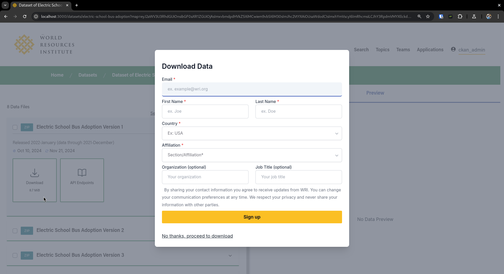
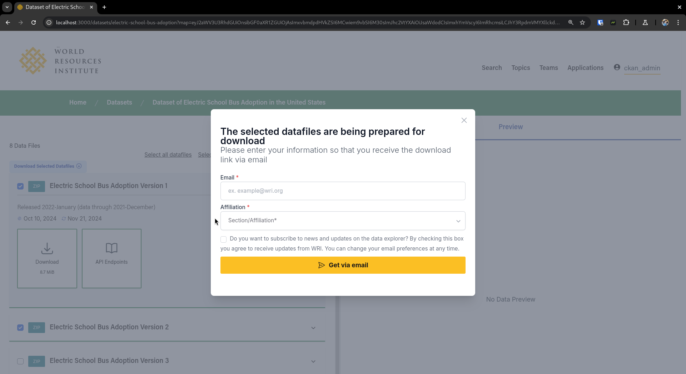
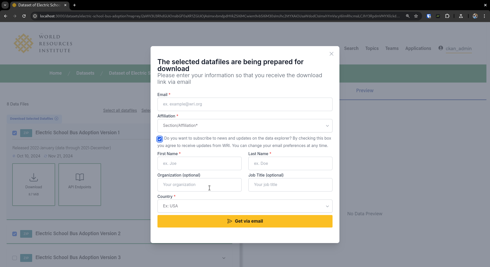
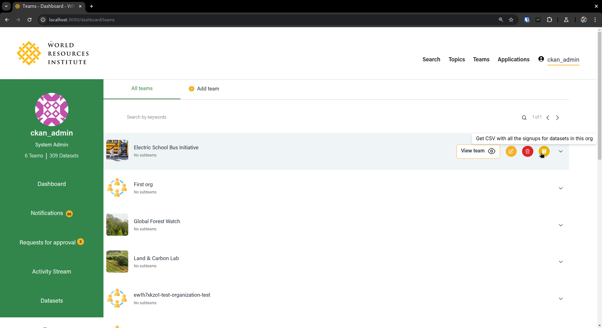
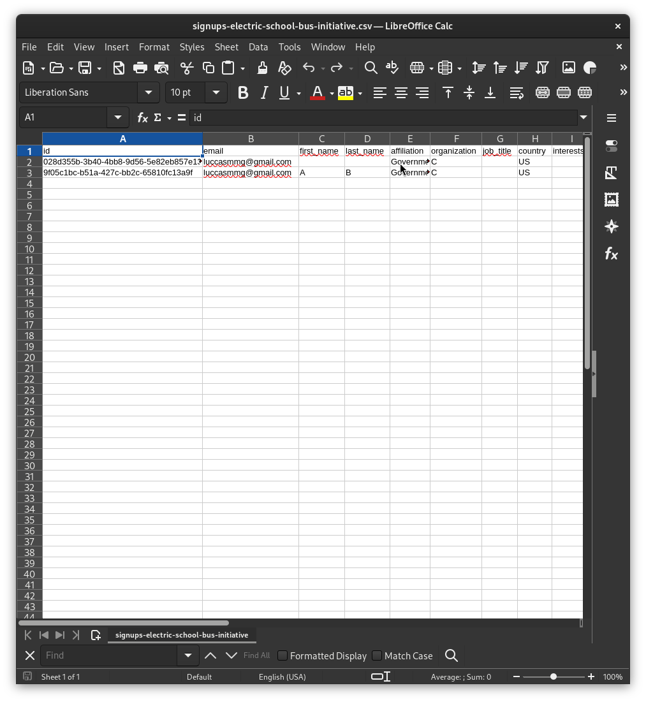

# DOWNLOAD SUBSCRIPTIONS

With the objective of gathering more data about the people who are downloading the available files in the portal, 
we added a little form with some questions everytime that a user tries to download something, the popup can be seen in two instances

- When we have a direct download, meaning that the file is already on S3 ready to be download
- When some background job is required on that file so it gets eventually sent to the user by email

In both cases we show a popup.

In the first scenario the user has a button that allows them to bypass the form and go straight to download as its shown below

In the second scenario, by default the form will just ask for email and type of institution, both informations we store, if the user clicks on the checkbox
we show some extra fields that can be filled out

Finally these informations can be exported by the organization admin that controls these datasets, as a CSV file 

