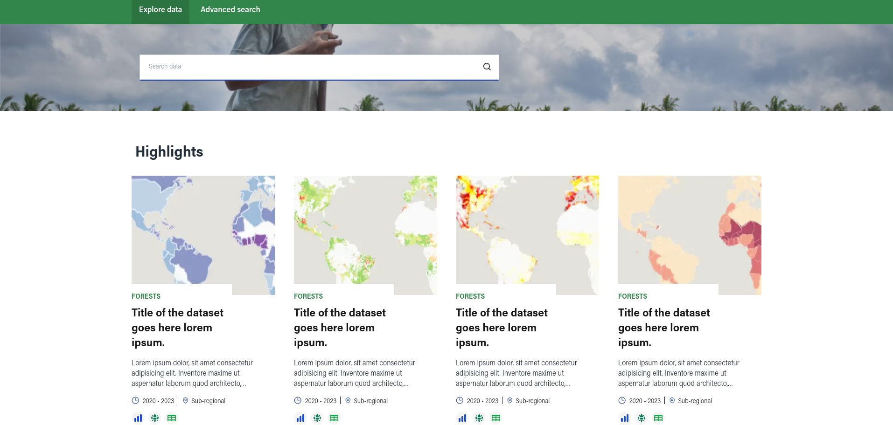
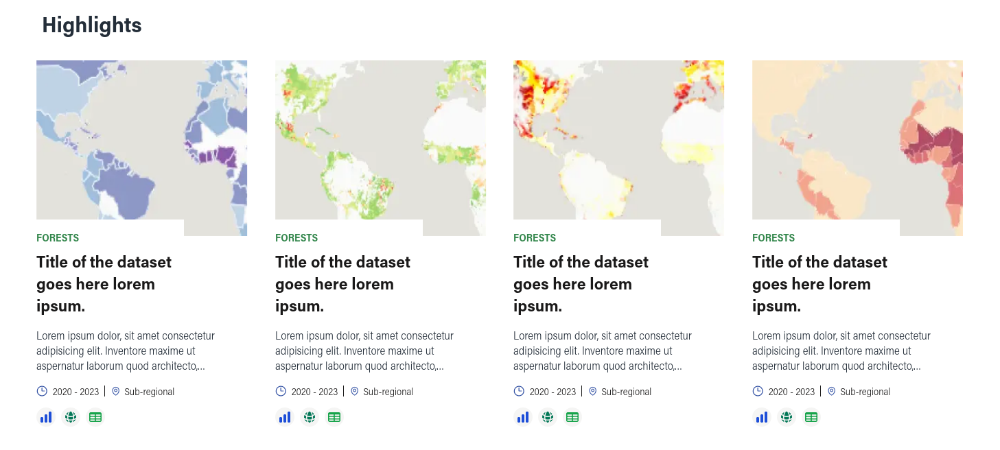
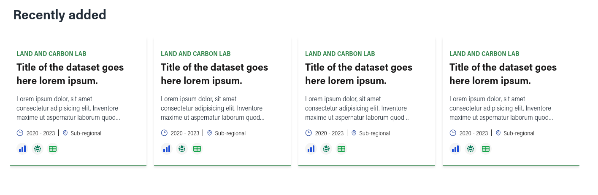
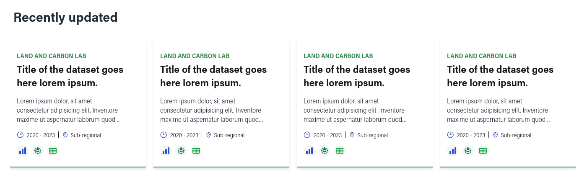

# Explore Data

Users can access `/search` and find some highlighted datasets and a search input.

## Search

The first section on the page allows users to search datasets by keyword.

Note that after entering some text on the search input and hitting enter, users will be redirected to the [advanced search page](../search), in which it's possible to see and filter the results.

## Highlighted datasets

Highlighted datasets are datasets that were marked as featured datasets.

These datasets are sorted by last modified and display an image chosen by the author.

## Recently added datasets

Next, there are the recently added datasets. As the name suggest, this section shows the last 8 datasets that were created.

## Recently updated datasets

Finally, there are the recently updated datasets. Also as the name suggest, this section shows the last 8 datasets that were updated.

