<!-- START doctoc generated TOC please keep comment here to allow auto update -->
<!-- DON'T EDIT THIS SECTION, INSTEAD RE-RUN doctoc TO UPDATE -->
**Table of Contents**

- [Setting up an API Tracking Exploration](#setting-up-an-api-tracking-exploration)
  - [Prerequisites](#prerequisites)
  - [Creating Custom Dimensions](#creating-custom-dimensions)
  - [Creating an Exploration](#creating-an-exploration)

<!-- END doctoc generated TOC please keep comment here to allow auto update -->

# Setting up an API Tracking Exploration

## Prerequisites

- [**Google Analytics**](https://analytics.google.com/analytics/web/) account
- [**Measurement ID**](https://support.google.com/analytics/answer/12270356?hl=en) from Google Analytics
- **Measurement Protocol API Secret** from Google Analytics (you will generate this in the Google Analytics UI: **Admin > Data Streams > choose your stream > Measurement Protocol > Create**)
- `wri_api_tracking` plugin enabled in your CKAN `.env` file
- `ckanext.wri.api_tracking.measurement_id` set in your CKAN `.env` file (this is your Google Analytics Measurement ID)
- `ckanext.wri.api_tracking.api_secret` set in your CKAN `.env` file (this is your Google Analytics Measurement Protocol API Secret)

## Creating Custom Dimensions

The API tracking uses 2 important custom dimensions:

- `action`: The action that was taken (e.g., `package_create`, `organization_show`, etc.)
- `user_agent`: The user agent of the client that made the request (e.g., `curl/7.68.0`, `ckanapi/4.0`, etc.)

These custom dimensions need to be created in your Google Analytics account before they will show up in your reports.

To create custom dimensions:

1. Go to the **Admin** section of your Google Analytics account.
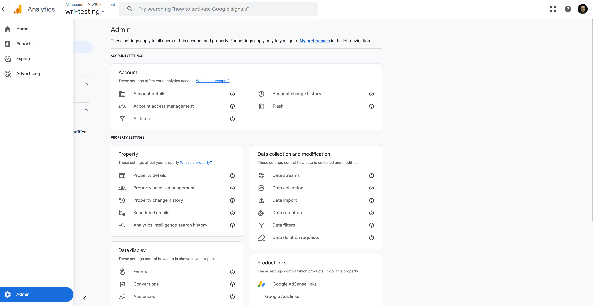

2. In the **Data display** section, click on **Custom Definitions**.

3. Click on **Create custom dimension** to create a new custom dimension (create one for `action` and one for `user_agent`—**Dimension name** will be the name displayed in the reports and **Description** is optional—**Event parameter** _must_ be set to `action` and `user_agent` respectively).
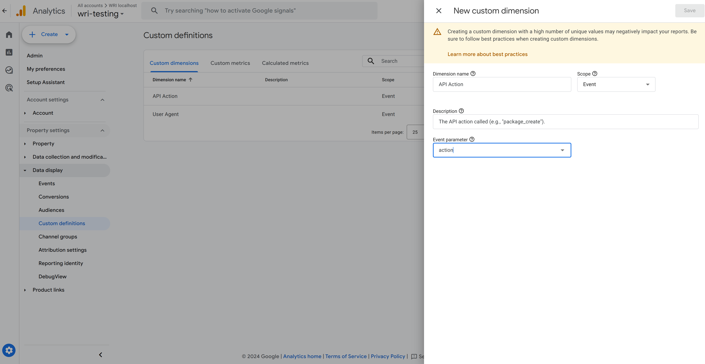

## Creating an Exploration

To create an exploration for API tracking:

1. Click on the **Explore** tab in your Google Analytics account.
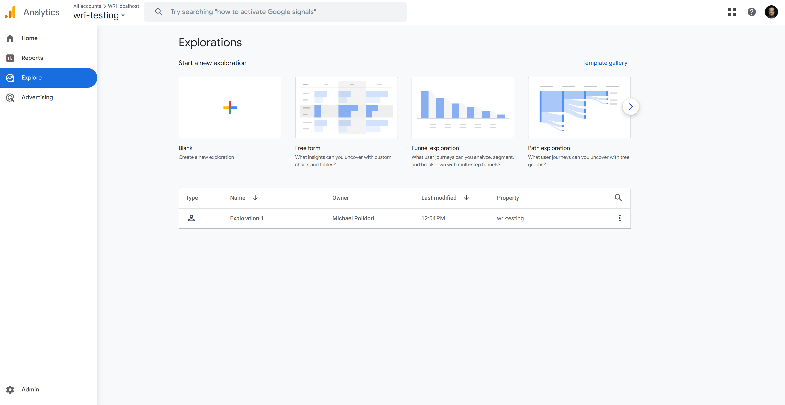

2. Click on **Blank** to create a new exploration (you can also choose a template if you prefer).
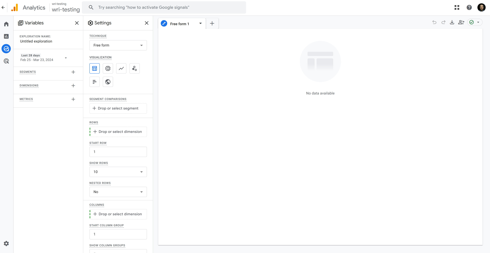
3. Set the name (e.g., "CKAN API") and date range for your exploration.
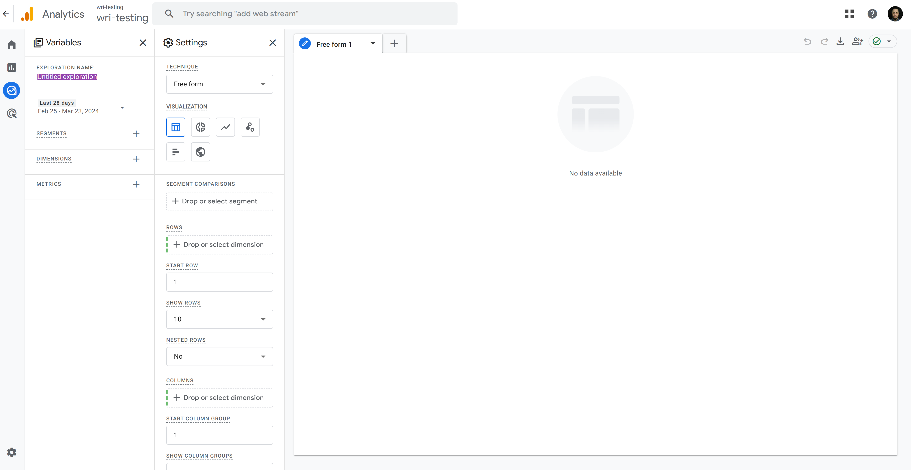

4. Add a **SEGMENT** to your exploration to filter the data to only show API requests. Click on the **+** icon to add a new segment and select **Event segment**.
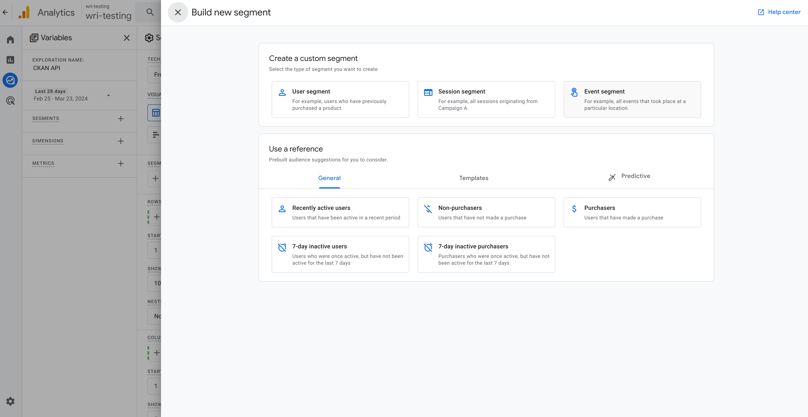
Choose a name (e.g., "CKAN API", "API Usage", etc.).
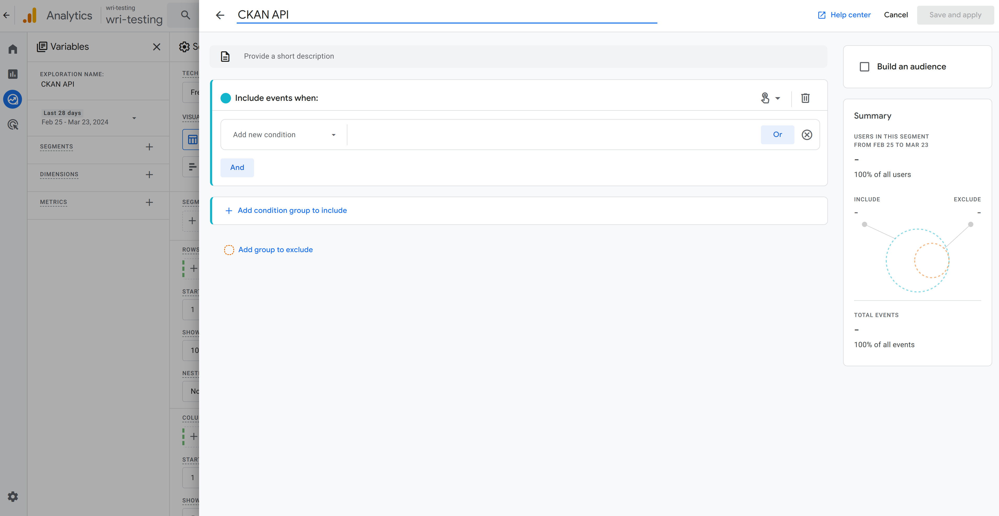
Select the event (this _must_ be `ckan_api` under **Events**).
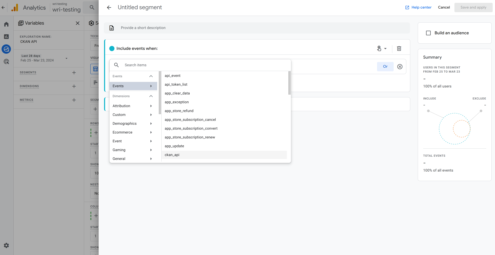
Save.
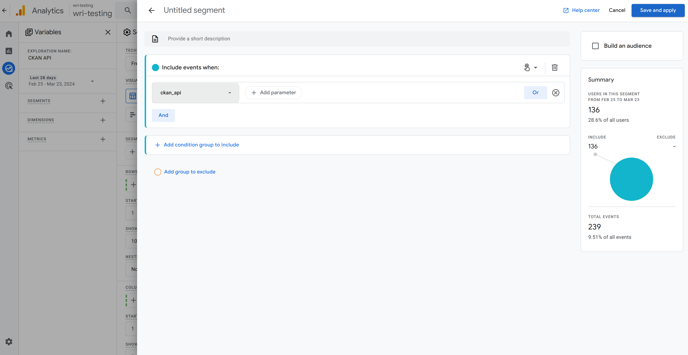

5. Add the dimensions under **DIMENSION**. Click on the **+** icon and add the following dimensions (**Custom** > **API Action**, **Custom** > **User Agent**, and **Event** > **Event name**—Note: the custom dimension names will be the names used in the "Creating Custom Dimensions" section above).
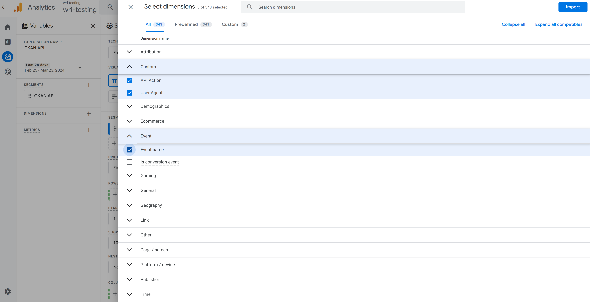

6. Add the metrics under **METRIC**. Click on the **+** icon and add the following metrics (**Event** > **Event count** and **Event** > **Event count per user**).
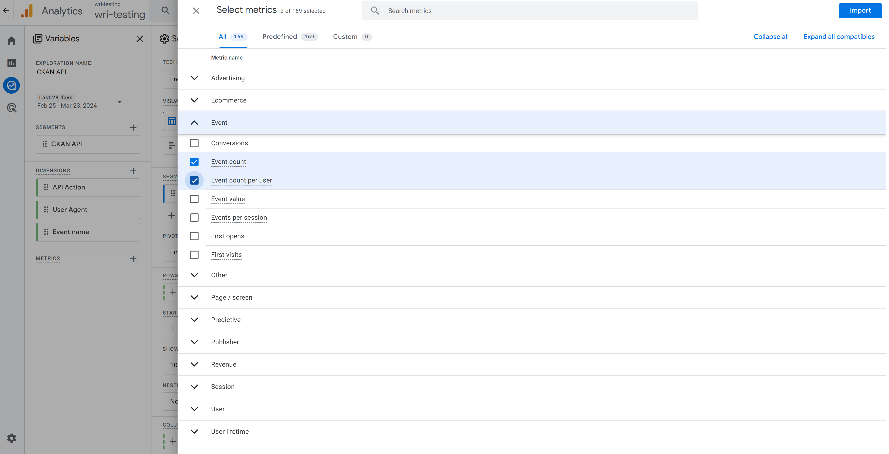

7. Proceed through the rest of the options in **Settings** as shown below (**Important**: no data will show up until **Event count** is added under **Settings** > **Values**).
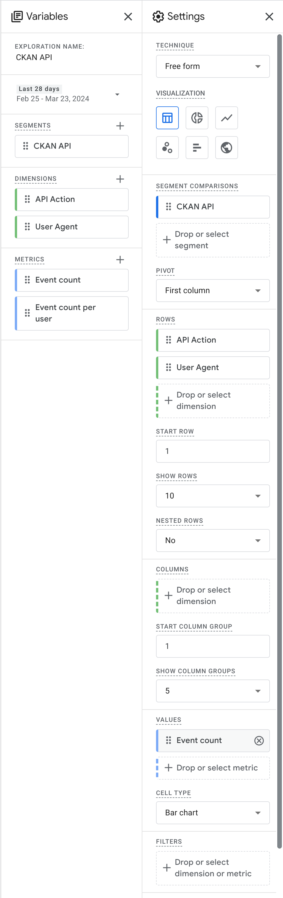

8. Once you've configured the Exploration, you should see the data.
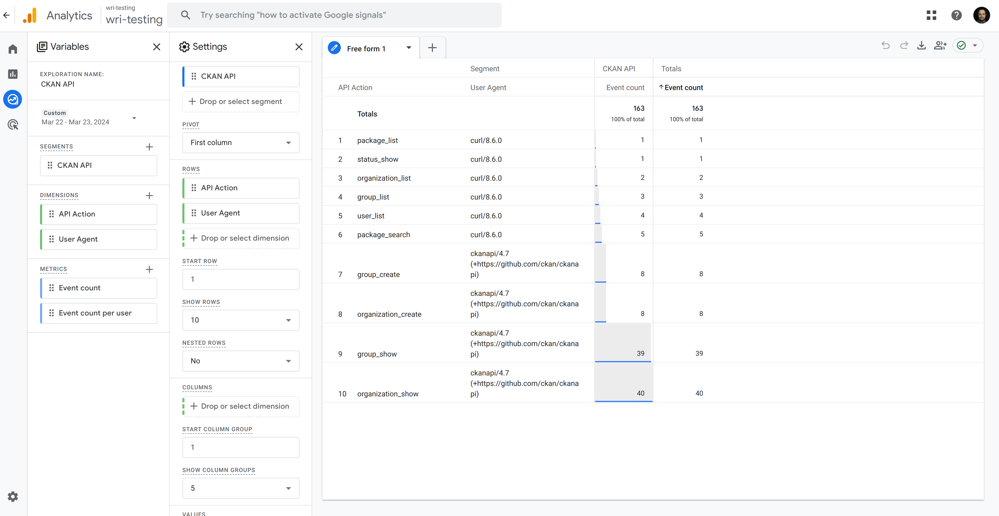

**Additional Note**: If you recently created the custom dimensions, it may take up to 48 hours for the data to start showing up in your reports. Any data collected before the custom dimensions were created will not be retroactively updated. This is a limitation of Google Analytics itself.
