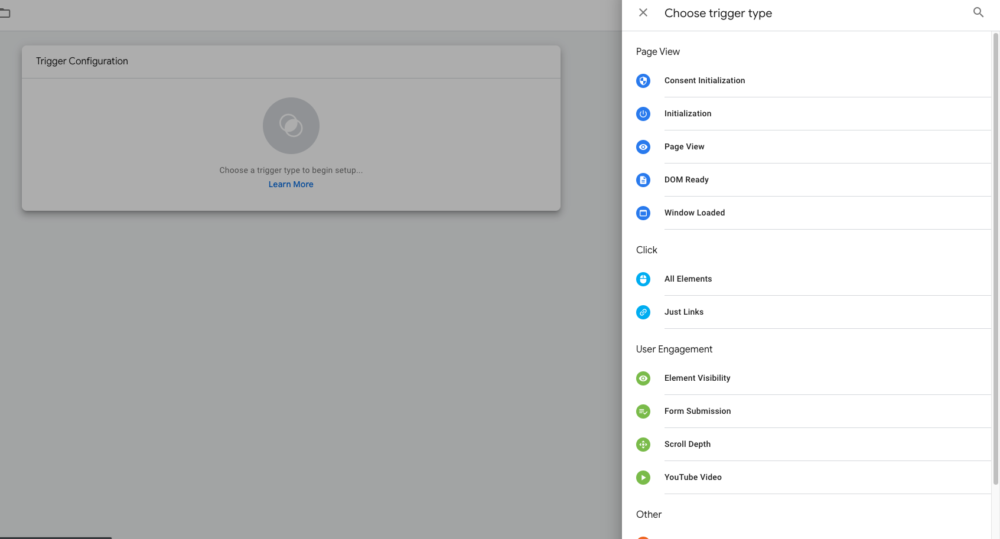
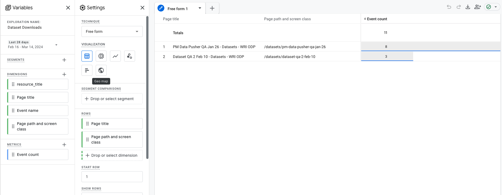

## Setup

### Create a Google Tag manager

go to `https://tagmanager.google.com/` click on `create Account`

fill up the required field

after creating the account copy the tag below into your website header and body

and it should lead to this workspace page

Let start with creating different triggers required for our report

To create a new trigger click on the new button and set the configuration

you can select the click element for instance

save and rename the trigger

also we can add `variables` to track , GTM already have most of the important variable has built in, we just need to import them

to add more builtin you can click on `configure` at the top right

also we have access to create custom user defined variable. here is one to track Resource title on download

in `User defined variables` click `new`

Now we can create Tags. this help create event that can be track on Google Analtyics for report

To start, copy your `measurement id` from Google analytics.

GA > Admin > Data streams

Back to Google tag manager (GTM), click on Tag and then click `New` to create a google tag

add your measurment id

click save. also here is an example of creating Tag to track dataset downloads

and then add a trigger

and here is the current list of Tags

## Report

1. General user report:
   Go to Google analytics . By your left click on `Home` icon

   

   this shows the number of user per week, per month etc has shown below

   

   to see the full report click on `view report snapshot`

   

   To share report click on the share icon to the top right

   

   For more analytics report, you can always expand the snapshot in the homepage, e.g here is an example for `user/ country`

   

   You can also click on the `+` button to add more column

   

2. Visited Pages:

   To your left in google-analytics dashboard, click on `Report > Engagement > Pages and Screens`

   

   it has search bar to filter per for pages

   you can also click on the drop down to switch the column

   

3. Custom report. we already have some of the report build down for exploration

   

   here is an example of `Dataset visit` report

   

   and also for `Dataset downloads`

   

   `map interactions` to track `layer id` , `lattitude` , `longitude` and `zoom level`

   

   `Table views` contains data on `View table preview` and the default table preview

   

## Adding Hotjar

Go to https://insights.hotjar.com/site/list and create a new site or update a site

and then copy the tracking code to the site

once that is done we need to create a survey to know why user are downloading dataset. to do that, we will trigger HOtjar via GTM

so fo to gtm to create a tag

and then back to hotjar to create survey

we are going to select `Customer satisfaction (CSAT) survey` templates

You can update different part of the survey. here we will update the Question and how we trigger the survey

and also the trigger. we will make use of the event `click` we created from GTM

and then click save

To view the survey created, you can go to any dataset page containing a resource click on download and this will trigger the survey for that user, if the user has never fill out a survey

