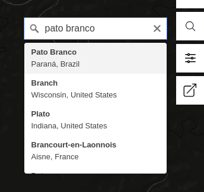
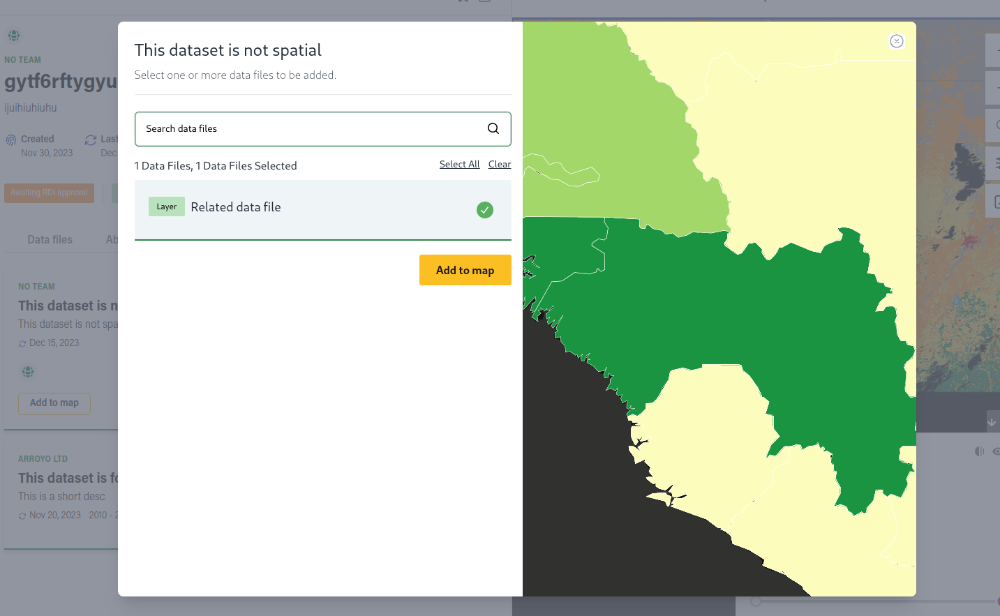

# Map View

Datasets with geospatial data can be visualized in a feature-rich map on the dataset page.


## Controls

The map has a few controls on the top-right corner.


1) Zoom in
2) Zoom out
3) Geolocation search
4) Map settings
5) Export as

### Geolocation search

Geolocation search allows users to provide the name of a city, state or country and make the map navigate to it.



### Map settings

The map settings control allows users to change some visualization settings of the map, including the style of the basemap and labels and whether boundaries should be shown or hidden.


### Export as

The export as control allows users to export the map as an embedding.


## Legends 

Legends on maps are configured by changing the `legendConfig` prop of the layers and provide some extra functionallity to the maps. Some of the features are:

- Display layer metadata such as the title
- Render legends, that could be "choropleth", "gradient", "basic", "proportial" or "multiple" (for multiple legends)
- Reoder layers
- Hide layers
- Change layer opacity


### Multiple legends

Layers can have multiple legends if the `type` of the `layerConfig` is `multiple`. E.g.:

```json
{
  "type": "multiple",
  "items": [
    {
      "type": "choropleth",
      "items": [
        {
          "color": "#fee5d9",
          "name": "<20"
        },
        {
          "color": "#fcae91",
          "name": "<40"
        },
        {
          "color": "#fb6a4a",
          "name": "<80"
        },
        {
          "color": "#de2d26",
          "name": "<200"
        },
        {
          "color": "#a50f15",
          "name": "≥200"
        },
        {
          "color": "#808080",
          "name": "No data"
        }
      ]
    },
    {
      "type": "choropleth",
      "items": [
        {
          "color": "#fee5d9",
          "name": "<20"
        },
        {
          "color": "#fcae91",
          "name": "<40"
        },
        {
          "color": "#fb6a4a",
          "name": "<80"
        },
        {
          "color": "#de2d26",
          "name": "<200"
        },
        {
          "color": "#a50f15",
          "name": "≥200"
        },
        {
          "color": "#808080",
          "name": "No data"
        }
      ]
    }
  ]
}
```

### Thresholds

Some layers may contain different threshold. In this case, a new select will be shown on the legends allowing the threshold value to be changed:


## Add layers from other datasets

Layers from other datasets can be displayed on the map by:

### 1) Adding layers from related datasets

On the dataset page, there's a "Related datasets" tab. If a related dataset contains layers, a "Add to map" button will show up for this dataset, allowing the user to select which layers he'd like to add to the current map.



### 2) Adding layers from any dataset

On the map, there is a "Add layers" button which can be used to add layers from any dataset on the portal.


