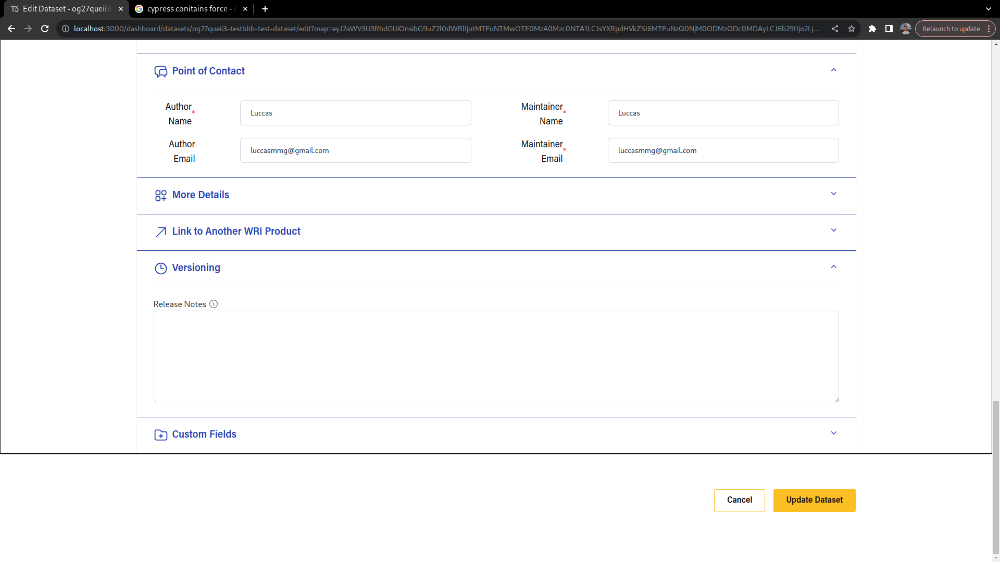
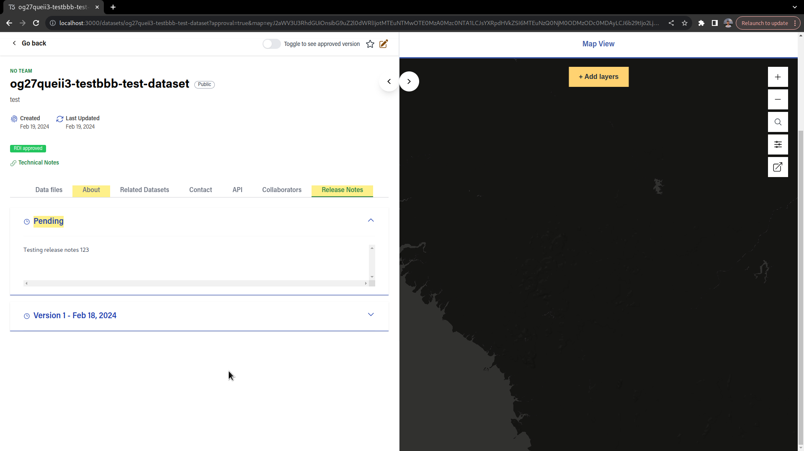
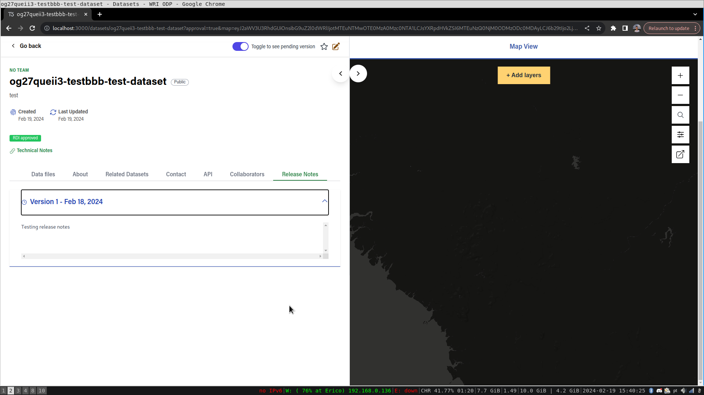

# Release Notes

Among the dataset fields, the Release Notes field can be found. This fields serves the purpose of describing the history of changes of a dataset to users, so that they can find out what, why and when the dataset was updated.

Datasets can be created with or without release notes, and when the dataset is edited, a new entry will be shown in the release notes tab in the dataset page.

The name of the versions is simply the index of the unique release notes, and the date indicates when the approval of the changes happened.

