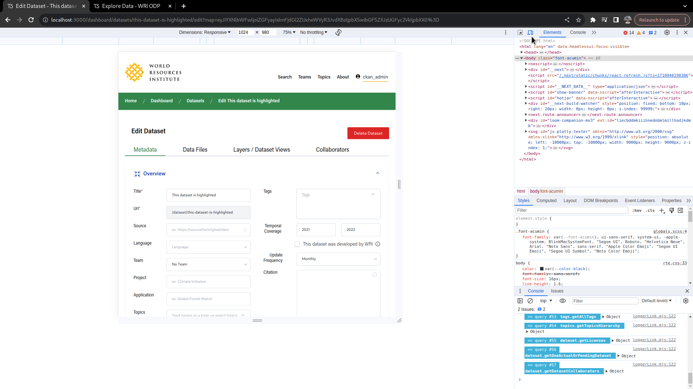

## Responsive Web Design

This website was developed in a way that makes it usable in any screensize or device.

### Testing

In order to test RWD, the recommended approach is to use the DevTools on the Chrome Web Browser.

You can find a guide on how to use it at https://developer.chrome.com/docs/devtools/device-mode.

### Breakpoints

The site was optimzed primarly based on the following screen widths (which can easily be found at the top of the Chrome Devtools):

- 320px
- 375px
- 425px
- 768px
- 1024px
- 1440px
- 2560px

