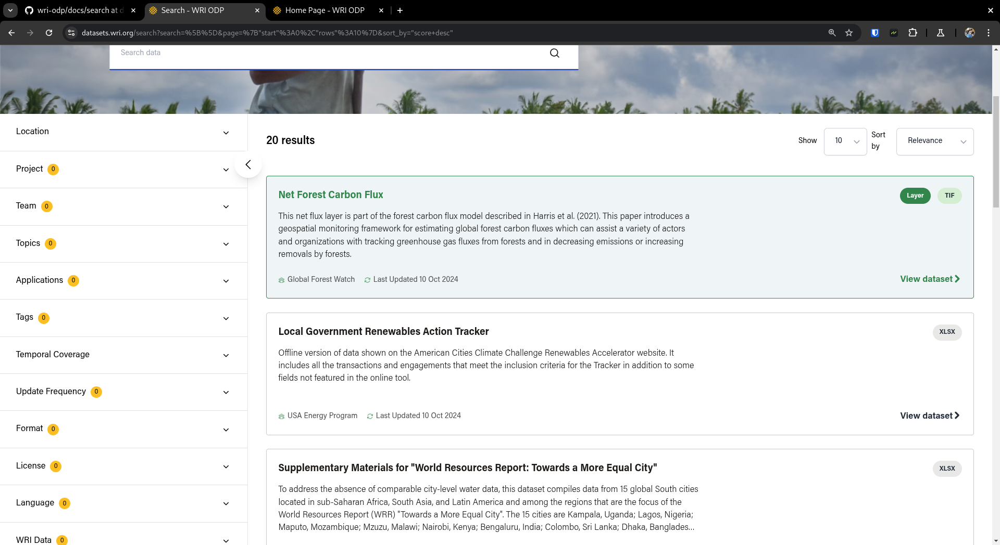
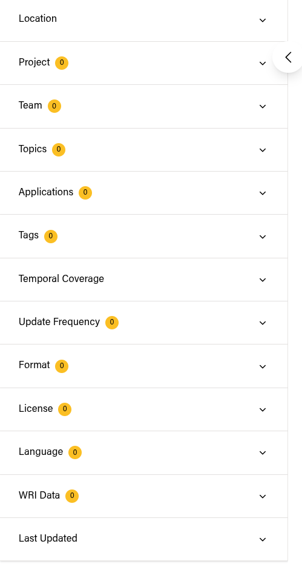
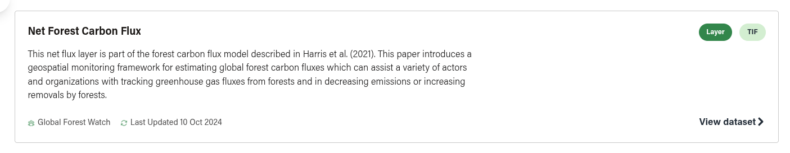
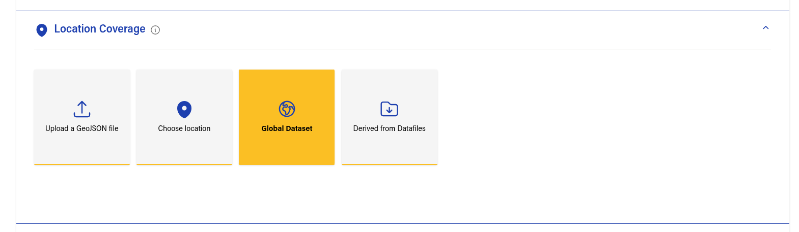

# Search

## Advanced search

Users can find advanced search on `/search`.

### Facets

With this feature, it's possible to filter datasets by the following facets:

- Location
- Project
- Team
- Topics
- Applications
- Tags
- Temporal Coverage (start and end)
- Update Frequency
- Format (of the data files)
- License
- Language
- WRI Data (Yes or no)
- Visibility (Only if logged in)

### Keyword search

Note that it's also possible to search by keyword, which will match a variety of fields, including title, description and others. Check out the exaustive list below:

- Teams
- Topics
- Tags
- Formats
- License
- Language
- Project
- Applications
- Temporal Coverage
- Update Frequency
- Visibility
- Source (URL, exact match)
- Technical Notes (URL, exact match)
- Citation
- Short Description
- Description
- Author Name
- Author Email
- Maintainer Name
- Maintainer Email
- Function
- Restrictions
- Reason for Adding
- Learn More (URL, exact match)
- Cautions
- Summary

### Sorting

Available sorting options are:

- Relevance
- Name Ascending
- Name Descending
- Last Modified
- Featured
- WRI Data

### Share search URL

When a user searches on the search page, the URL gets updated containing the state of the current page. This URL can be shared with other users, which will be able to see the same results.

### Dataset metadata

Results are displayed using the following card:

As you can see we have the title at the top, the description below, and in the bottom the team name for that dataset and the last updated date, on the side we have the available formats for that particular dataset, which in this case would be "Layer" and "TIF"

### Location search

When creating or editing datasets, there are two options to index a dataset spatially:

1. Upload a GeoJSON file
2. Choose a location string
3. Set the dataset as global
4. Derive the location from the daafiles

After a dataset is spatially indexed, it will show up on location searches on the search page.

#### GeoJSON file

Datasets spatially indexed by uploading a GeoJSON file will be shown on results based on the following algorithm

1. If you type in the search bar a country or a province/state we will try to grab that place boundaries from the GADM Datasets, and then check if the GeoJSON intersects somewhere with that boundary
2. If what you type can be seen as a city, we will grab the coordinates from it, and check if the GeoJSON uploaded contains that point inside

#### Location string

Datasets spatially indexed by setting a location string will be shown on results when the search query has a "ext_address_q:{location string}" parameter which matches the end on the dataset's location string.

Example: if a dataset is indexed with location string set to "Paraná, Brazil", search queries with ext_address_q set to the following values will match

1. Pato Branco, Paraná, Brazil
2. Paraná, Brazil

#### Global Dataset

This is just a special address that makes the dataset always shows up in the location search unless specifically requested to exclude global datasets

#### Derived from datafiles

As it is explained on the `datafile-location-search` docs, the collection of files that a dataset has(Datafiles) can also have additional metadata attached to each individual item, this means that you can add a GeoJSON, 
a location string or set the datafile as global same as the dataset, if your datafiles contain GeoJSONs, and you select this option for the dataset as a whole, the system will try to merge all of these GeoJSONs into a single
polygon and use that as the dataset location
