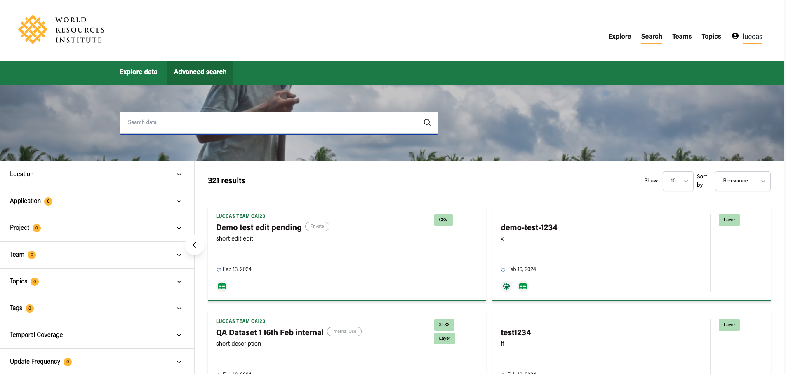
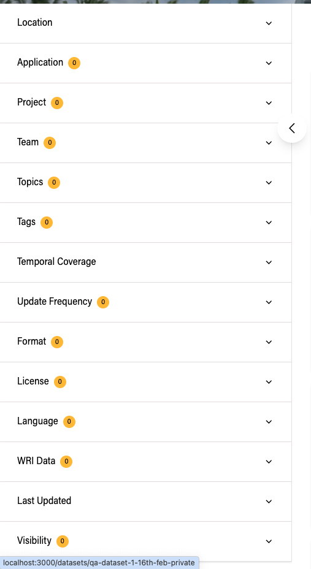

# Search

## Advanced search

Users can find advanced search on `/search_advanced`.

### Facets

With this feature, it's possible to filter datasets by the following facets:

- Location
- Featured (Yes or No)
- Application
- Project
- Team
- Topics
- Tags
- Temporal Coverage (start and end)
- Update Frequency
- Format (of the data files)
- License
- Language
- WRI Data (Yes or no)
- Visibility

### Keyword search

Note that it's also possible to search by keyword, which will match a variety of fields, including title, description and others. Check out the exaustive list below:

- Teams
- Topics
- Tags
- Formats
- License
- Language
- Project
- Application
- Temporal Coverage
- Update Frequency
- Visibility
- Source (URL, exact match)
- Technical Notes (URL, exact match)
- Citation
- Short Description
- Description
- Author Name
- Author Email
- Maintainer Name
- Maintainer Email
- Function
- Restrictions
- Reason for Adding
- Learn More (URL, exact match)
- Cautions
- Summary

### Sorting

Available sorting options are:

- Relevance
- Name Ascending
- Name Descending
- Last Modified
- Featured
- WRI Data

### Share search URL

When a user searches on the advanced search page, the URL gets updated containing the state of the current page. This URL can be shared with other users, which will be able to see the same results.

### Dataset metadata

Results are displayed using the following card:

1) Team
2) Title
3) Short description
4) Last updated
5) Temporal coverage
6) Location
7) Has chart view
8) Has map view
9) Has tabular view
10) Has cautions
11) Formats of the data files

### Location search

When creating or editing datasets, there are two options to index a dataset spatially:

1) Upload a GeoJSON file
2) Choose a location string

After a dataset is spatially indexed, it will show up on location searches on the advanced search page.

#### GeoJSON file

Datasets spatially indexed by uploading a GeoJSON file will be shown on results when the search query has a "ext_spatial_q:x,y" parameter which defines a point within the uploaded shape. 

#### Location string

Datasets spatially indexed by setting a location string will be shown on results when the search query has a "ext_address_q:{location string}" parameter which matches the end on the dataset's location string.

Example: if a dataset is indexed with location string set to "Paraná, Brazil", search queries with ext_address_q set to the following values will match

1) Pato Branco, Paraná, Brazil
2) Paraná, Brazil

