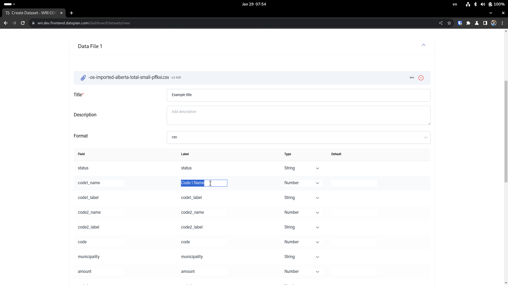
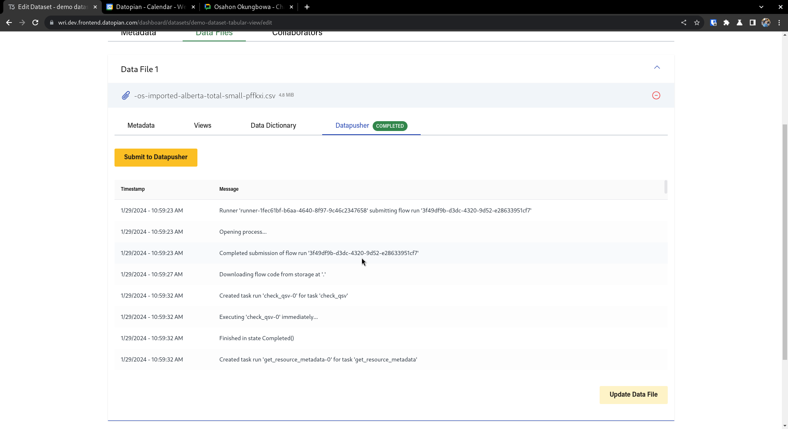
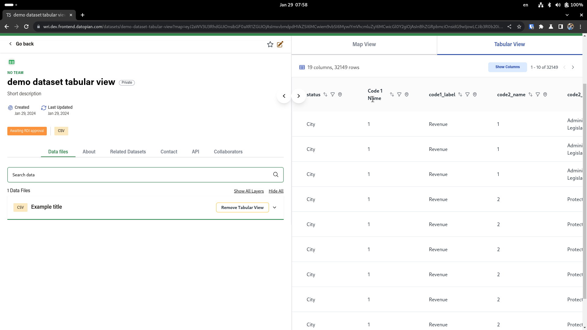
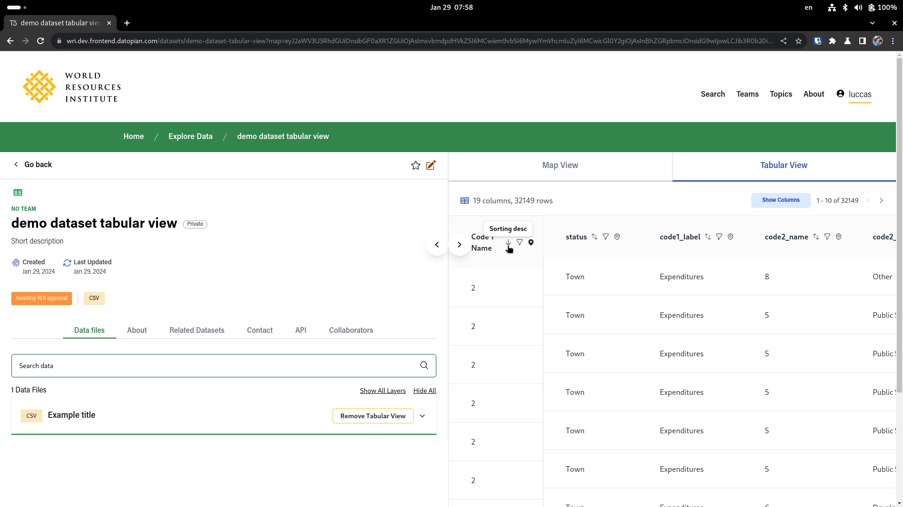
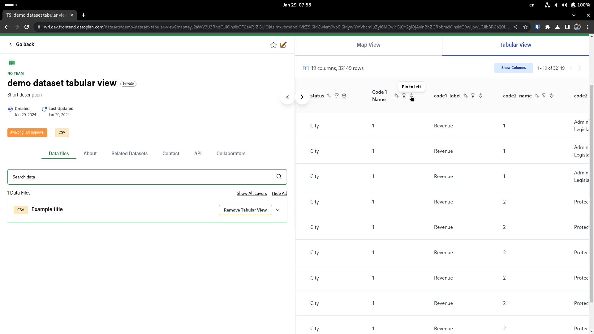
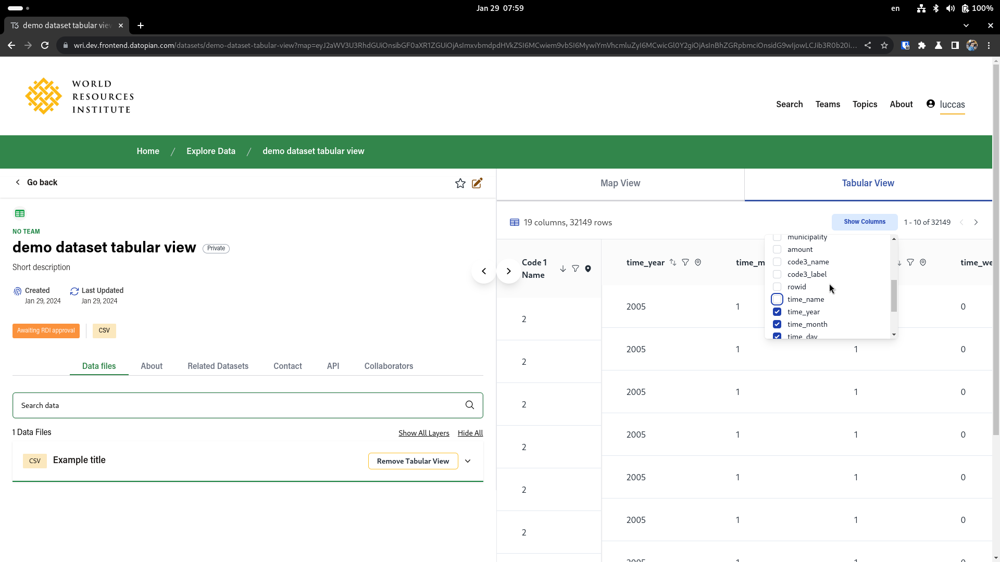
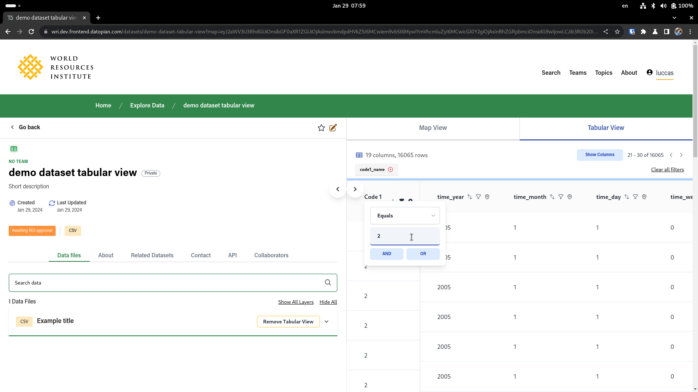
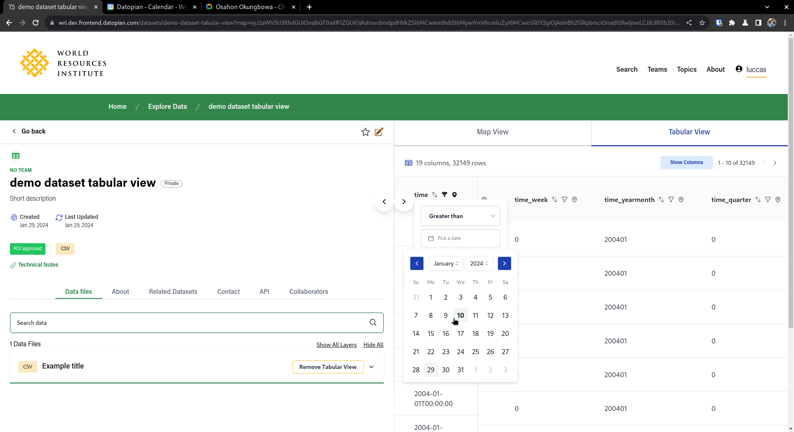
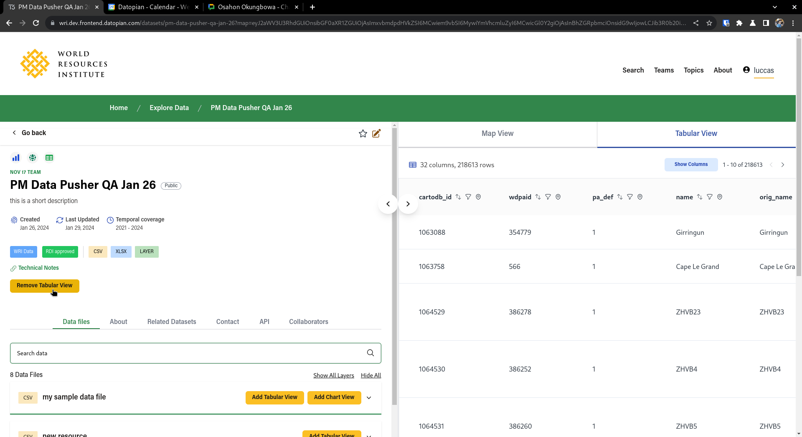

# Tabular Previews

Tabular previews are shown everytime you upload a CSV/TSV/TAB/XLS/XLSX/ODP file to the ODP, out of these, the one we suggest are CSVs, 
thats because they are the simplest ones, and can be divided into bytesized chunks, this means that when you upload a CSV we can parse the 
contents of the file while the upload happens and show you the following table.

This table has the following columns

- Field: Not editable, just shows the name of the column inside the CSV
- Label: Allows you to give a nicer looking name for the columns, ideally columns shouldnt have space, so this is a good place to remove underscores
- Type: We try to guess the type of the columns, but you can override then using thie column
- Default: It basically allows you to set a string to show if the value is identified as an empty string or null

Once you save the dataset, an asynchronous job is setup that will read the files, infer the types, and using the data dictionary  will try to setup a SQL Table that can be queried directly
You can see the logs for this job in the datapusher tab inside the edit page for the specifc datafile

Once the job is completed, the file will be available for querying in the datastore, 
this allows us to show the data in a tabular preview inside the dataset individual page, all the user has to do is click on "Add Tabular View"

This table allows the following operation

- Pagination by clicking on the arrows at the top
  - 
- Sorting by clicking on the arrows in the column, both asc and desc
  - 
- Pin specific columns to the left allowing you to better compare values
  - 
- Hide columns that you do not want to see at that specific moment
  - 
- Filter data whereaver you like, by clicking in the funnel icon in the column, filters can be removed easily in the top bar
  - 

If the column is inferred as a timestamp, then instead of a normal input a datepicker will be shown in the filter

Finally, if when you created the dataset you've setup a valid connectorUrl, you can also show the same preview for data that is stored in the resource watch api, by clicking in the 'Add Tabular Preview' button at the dataset level, this will use the `query` endpoint inside RW to query the data, so its contingent on that working

