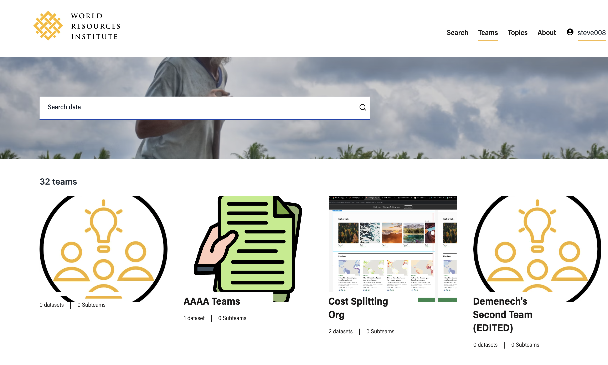
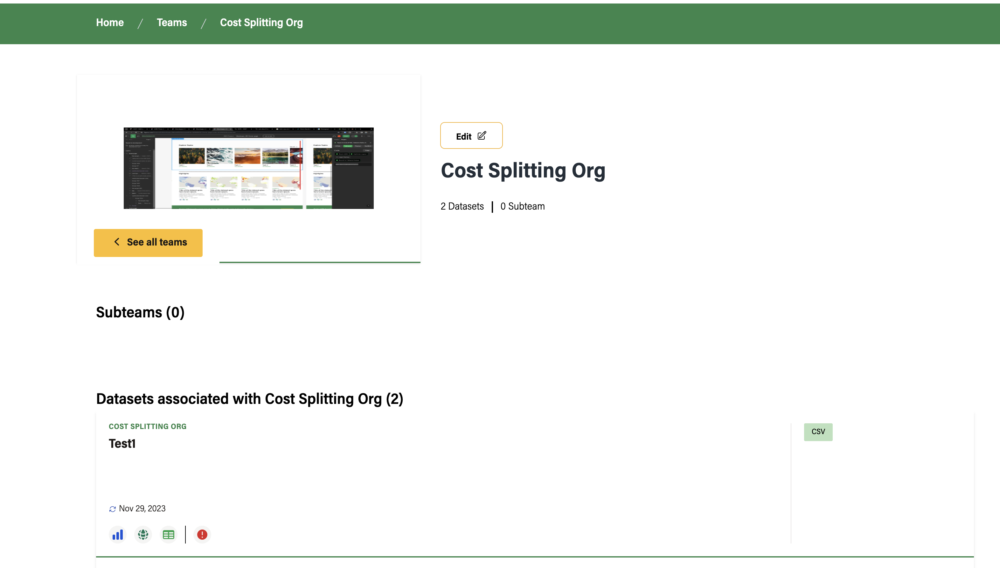
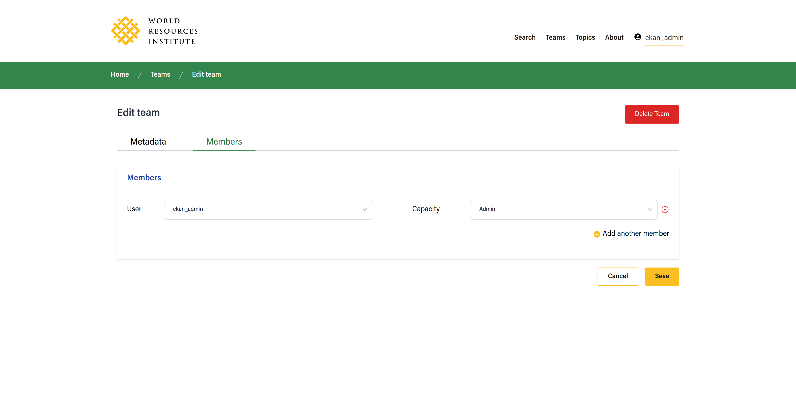
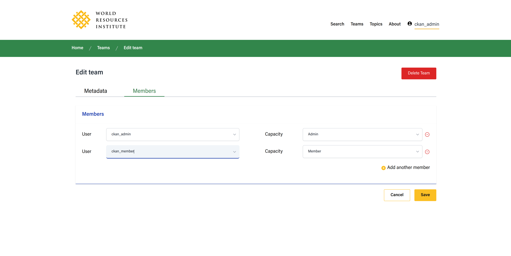

# TEAMS

## Create Team

You can create a team in the `/dashboard/teams/new` route where you can define

- Title for the team
- URL for the team, which is going to act as an ID for the team, and act as URL in the public pages such `/teams/{team url}`
- Description for the team
- You can also upload an image to act as a logo or featured image for the team
- You can also define a parent for the team, which is going to be another team and is going to decide the place of that team inside the hierarchy

The page looks like this

## Edit Team

You can edit a team by going to `/dashboard/teams/{team url}/edit` or by clicking on the yellow icon in the teams list like in the image below

Once you go there you can change all the fields that were defined in the new team except the `url` which needs to stay the same for the integrity of the system's sake

In this edit page, you can also delete by clicking on the "Delete Button" which should open up a modal for confirmation

## Teams Discovery page

Teams discovery is located at `/teams`, which displays all available teams on the platform

On this page, you can search for any team. If there are greater than 10 teams, they will be paginated.

Clicking on any of the teams should lead to the team's page itself, where you can see its subteams and dataset. It will include an edit button if you are logged in and have edit permissions.

## Team Member Management

Team members can be managed from the team edit page "Members" tab

To add a new member, simply click on "Add another member", select the user and their capacity, and then click "Save" (you can also edit any existing members, or remove them by clicking on the small red `-` button on the right)

