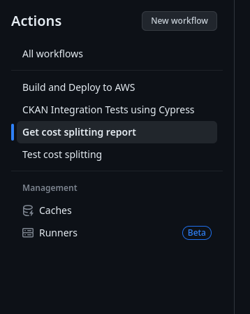

# Cost Splitting Report 

This explanation is going to be divided into 3 parts.

- How to trigger the report
- How the script works
- What we are testing and how we are testing

## How to trigger the report

To trigger the workflow, all you need to do is:

- Go to the actions tab in the repo 

- Select the workflow which in this case is going to be "Get cost splitting report"

- Trigger the workflow and optionally add as input a comma separated list of emails that should be notified when the report has been finished


Once this is done you will possibly have three things

- An email will be sent to the addresses used as input, it should look like this

- The list of organizations with their respective percentage of the total storage costs in CSV Format, this will have the percentage for every report ever done, so organizations will appear multiple times, one for each time they appeared on the report

- A CSV File with the date of the report in the name, that only shows what were the outputs at that specific point in time


## How the scripts works

The code can be seen in 

- https://github.com/wri/wri-odp/blob/main/scripts/cost-splitting/script.py
- https://github.com/wri/wri-odp/blob/main/scripts/cost-splitting/lib.py
- https://github.com/wri/wri-odp/blob/main/.github/workflows/cost-splitting-report.yml

It will basically 

- Get a list of all top level folders in the S3 Bucket, assuming that the bucket has a structure similar to this
```
org_1/resources/{resourceId}/filename.csv
org_2/resources/{resourceId}/filename.csv
...
```
- Get a total of storage for the entire bucket
- For every one of these top level its going to get a sum of all the files inside that org 
- Create a report and save it to the files
- Send an email saying "Hey your report is done"(Only if a list of emails has been provided)
- Commit the new CSVs to the repo so they can be seen

Obs: Theoretically there could be a scenario where the person opens the links in the emails and the files are not comitted yet from my experience this process takes miliseconds, plus this allows us to simplify the code and use the official github action which is probably much more robust than any solution i can come up inside the python script specially because there isnt even an official SDK for github in Python

Besides this there are two more caveats

- Firstly if you delete a resource in CKAN, that's going to only do a soft delete in the metadata entity, the file will stay in S3, you can periodically do a purge of unused files, but thats an extra steps that has its own risks
- Secondly, if you move a dataset and its corresponding resources from one organization to another, the bucket structure will stay the same, you could theoretically run a cron job that checks that and tries to move things around, but i would advise against it as it would lead to a lot of broken links

## What are we testing 

We are testing mostly the logic that decides the percentage costs, we use `moto` whic is a library that allows us to mock S3 Services, we then put two files with the "hello world" content, which takes exactly 11 bytes and then check if those results match what we expect

The test files can be found in https://github.com/wri/wri-odp/blob/main/scripts/cost-splitting/test_script.py
